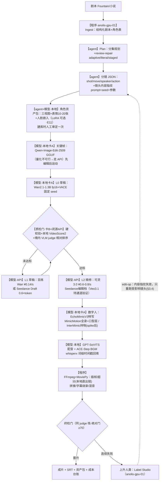
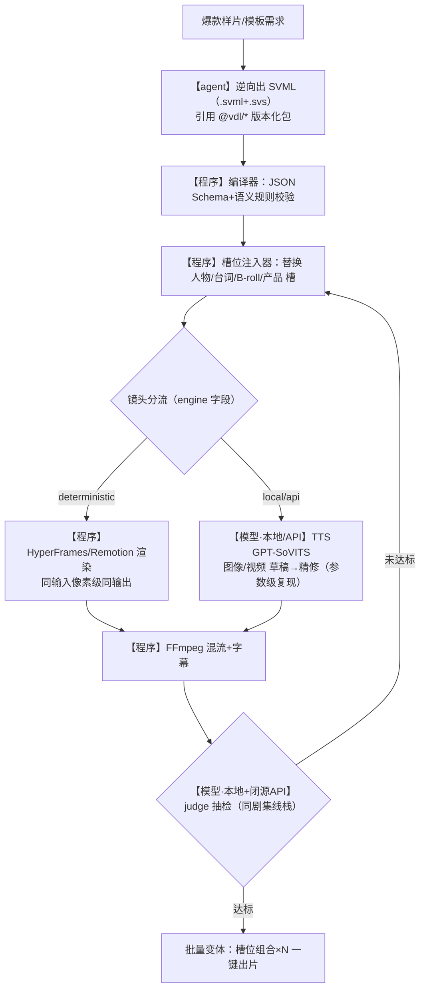

# AI 视频生产流水线完整方案（修订版 v2）

> 调研完成于 2026-09-28｜v1 草稿同日成稿｜**v2 依据独立评审 15 项意见修订（2026-09-28）**

## 前言

本方案给出在「anolis-gpu-01（2×V100S-PCIE-32GB，SM70/仅 fp16/无 NVLink）+ 境内视频生成 API 混合算力」上，建设两条产线的完整工程方案：**剧集线**（剧本→分镜→角色→关键帧→逐镜视频→合成→配音字幕，全自动达到人评锚定的 70 分）与**模板线**（SVML 风格 DSL 结构化源文件→槽位替换→确定性渲染），两线共享质检栈、角色资产库、编排与渲染底座。v2 相对 v1 的主要修订：①质检门槛三处矛盾统一为「阈值/样本量登记表」（表 2-1）并按缺陷组分别设门，删除「100% 拦截/零漏检」；②补齐闭源 judge 选型（境内 VLM API 具名）与调用量/成本入账；③双卡分工改为时间片互斥并给出卡分配表；④补全身对白镜头的口型层方案与插帧/超分环节；⑤关键帧编辑器、LoRA 训练、InterMimic 补验证实验，关键帧「或双卡」违反禁令处删除；⑥编排底座迁出无虚拟化的本机（windev-01 无 VT-x，Linux 容器不可行）；⑦成本模型按晋升制重写并计入 judge API 与人工成本；⑧「70 分」锚定到人评量表并定义聚合函数；⑨缓存键统一为内容寻址唯一规范；⑩P1 确定性验收口径修正；⑪E3/E6 引用修正并补 Wan2.2-Animate-14B 等实验条目；⑫Veo/Runway 通道验证入 T8；⑬数值口径全部归一到登记表；⑭示例 VDL 补 props 定义、校验器补跨镜头引用规则。凡修订新增且调研材料无实据的数字，一律标注「假设/待实测/未确证」，不冒充实测。

## 阅读指南

| 读者 | 建议路径 |
|---|---|
| 决策/预算 | §1.1 需求与量化口径 → §2.2 渲染策略 → §6.3 成本模型 → §6.4 风险 |
| 架构/后端 | §1.2–§1.5（架构与反馈闭环）→ §3（DSL 与缓存键规范）→ §4.6（部署与双卡分配） |
| 算法/质检 | §2.3（70 分标定与表 2-1）→ 第四章全部 → §6.2 实验清单 |
| PM/排期 | §5 P0–P3 任务与验收标准 |
| 口径争议仲裁 | **一律以表 2-1（§2.3）为唯一权威**；正文与登记表冲突时以登记表为准 |

**标注约定**（全文统一）：「实测」=调研来源一手数据（本会话未在 GPU 机运行任何模型，我方复测全部排在 P0/E 系列）；「假设」=本方案设定、待 P2 运营回填；「未确证」=公开来源转述、采购/接入前须核实；「修订新增」=v2 为解决评审问题新增的选型或数字，调研材料无对应实测。

## 目录

- 第一章 需求与总体架构（1.1 需求拆解 / 1.2 架构原则 / 1.3 剧集线架构 / 1.4 模板线架构 / 1.5 反馈闭环）
- 第二章 技术选型（2.1 选型总表 / 2.2 混合渲染策略 / 2.3 「70 分」标定与阈值/样本量登记表）
- 第三章 描述语言与模板系统（3.1 设计原则与语法 / 3.2 校验器 / 3.3 DSL 到执行层映射 / 3.4 edit-op 与缓存键规范）
- 第四章 自动质检体系（4.1 缺陷分类学 / 4.2 五层流水线 / 4.3 judge 可靠性边界 / 4.4 校准闭环与金标集 / 4.5 人审工单 / 4.6 部署汇总与双卡时间片分配）
- 第五章 分阶段实施路线图（P0 / P1 / P2 / P3）
- 第六章 验证实验与自动化迭代（6.1 迭代机制 / 6.2 GPU 实验清单 / 6.3 成本模型 / 6.4 风险清单）
- 附录A 精选来源清单；附录B 开放问题与后续验证项

---

# 第一章 需求与总体架构

## 1.1 需求拆解

| # | 需求 | 工程约束 | 量化口径 |
|---|---|---|---|
| R1 | 剧集线无人干预达 70 分 | 七段链路（剧本→分镜→角色→关键帧→逐镜视频→合成→配音字幕）全自动跑通 | 「70 分」=人评锚定量表分（0–100，见 §2.3/表 2-1）：judge 分经 120 片段人评回归映射，70 ≙ 人评盲评 7.0/10。调研确认所有开源流水线均未公布质检阈值与人工上升率（最近似机制参照 wind-comic 的 Vision<70 自动重生成），须自建 judge 并标定 |
| R2 | 人类只在反馈节点介入 | 文字反馈、在图上圈选（Label Studio BrushLabels）、给参考图 | 反馈编译为 edit-op，缓存失效只重跑受影响镜头；**缓存键=镜头内容指纹（§3.4 唯一规范，内容寻址、不含镜头 id）**，Prefect 按键缓存 |
| R3 | 模板线确定性生成 | 类 SVML 结构化语言+槽位替换 | 确定性镜头（engine: deterministic）同输入像素级同输出（HyperFrames headless Chrome 逐帧 seek）；含 local/api 镜头的模板只承诺参数级复现（§5 P1 验收） |
| R4 | 质检无人化优先 | judge 重排+专用小模型硬校验 | 裸 GPT-4o 与人类 Spearman 仅 23.0，禁用；本地 VideoScore2 + 境内 VLM API 只做相对排序与校准分位，绝对门只挂终检（§4.2 L3/§2.3） |
| R5 | 数字人能行走/手势/持物 | 音频驱动只保「合理」不保「指定动作」 | 必须落姿态驱动层（MimicMotion/Wan2.2-Animate）与 3D 层（InterMimic，P0 spike 后定）；**全身对白镜头走「动作层+口型层」两段合成**（§2.1 数字人行、§3.3），不靠音频驱动兜底全身口型 |
| R6 | 硬件 2×V100S-32GB | SM70 仅 fp16：无 bf16/flash-attn/SageAttention；anolis-gpu-01 实证 PCIE 直通、驱动 570.133.20+CUDA 12.8、无 NVLink（`D:\agent-knowledge\09-anolis-gpu-01.md` 行16、行24） | 双卡禁 Tensor-Parallel（LTX/Hunyuan/Wan14B TP 均失败先例），只做 best-of-N 任务级并行；质检与生成按时间片互斥分卡（§4.6） |

两条产线共享同一内核：**生成 → 质检 → best-of-N 重排 → 反馈重做**。差异只在入口与确定性要求——剧集线从剧本进入、逐镜走扩散生成、靠 judge 兜底到 70 分；模板线从 SVML 源文件进入、槽位替换后确定性渲染、judge 只抽样把关。人类只出现在三处：角色资产包建库时一次性审定、judge 连续失败后的上升处理、显式反馈节点。

## 1.2 架构原则（四条）

1. **双线共享底座**：质检栈、角色资产库、编排（Prefect）、渲染终点（FFmpeg）两线共用；剧集线编排入口为 DramaClaw 式四段流水线（Ingest→Plan→Produce→Deliver，v2.0.5，可跳步/断点续跑），模板线入口为 SVML 编译器。**状态归属**：DramaClaw 只持有「剧本→分镜 JSON」段的状态（其自带断点续跑仅在内部生效），分镜 JSON 之后的逐镜生成/质检/合成任务全部由 Prefect 子流接管（§3.4），两套状态不叠加。
2. **双卡时间片分工**：卡A 常驻生成实例（图像/视频/数字人渲染），卡B 常驻质检（VideoScore2 + L2 专用检测器单卡分时队列；PaddleOCR/MediaPipe/PySceneDetect/FFmpeg 一律 CPU）。进入 best-of-N 重抽时卡B 让位加载第二生成实例、质检任务排队等待。**质检与生成的隔离是 Prefect 资源标签实现的时间片互斥，不是「显存互不抢占」**（v1 表述废弃）；分时段卡分配表见 §4.6。
3. **一致性=软约束工程，且与返修共用机制**：每角色资产包（三视图+表情 10-20 张+人脸嵌入库，LoRA 为可选增强、E11 达标后启用）+「先编辑后运动」+ VACE 逐镜注入参考；反馈圈选的 mask 与一致性注入走同一套 VACE MV2V 通道。
4. **确定性梯度分层**：能用程序渲染的（字幕/花字/版式镜头）绝不走扩散；所有扩散调用强制落盘 seed+参数指纹；跨引擎同 seed 不可复现，指纹按引擎分别记录。

## 1.3 剧集线端到端架构



| 阶段 | 执行者 | 产物 | 失败处置 |
|---|---|---|---|
| 0 剧本摄取 | 程序（DramaClaw Ingest，anolis-gpu-01） | Fountain 结构化剧本+角色表 | — |
| 1 集规划/分镜 | agent（LLM，走 API 网关） | 分镜 JSON：逐镜 speaker/action/shot/position/move（抄 FilmAgent/VideoClaw IR）+ 镜头内容指纹 | review-and-repair 自动修复一轮 |
| 2 角色资产包 | agent 出设定 → 本地模型出图 | 三视图/表情 10-20 张/人脸嵌入库（LoRA 可选，E11 达标后启用） | 人工审定一次入库 |
| 3 关键帧 | 本地模型（Qwen-Image-Edit-2509 GGUF 单卡 / VACE；量化不可行走 API，E10） | 逐镜关键帧 + 可选 src_mask | GGUF 档黑图→降量化档/换 FLUX.1-Kontext/走 API |
| 4 逐镜视频 | 本地草稿→API 草稿→API 精修（三档晋升） | 逐镜视频 | judge 三级处置：晋升/重抽/上升人 |
| 5 数字人 | 本地模型（EchoMimicV3 特写直出；全身 MimicMotion+口型层两段；持物 InterMimic 须过 P0 spike） | 表演视频 | 动作不符→3D 层（Blender 骨架经 mcp-for-blender）重排后再驱动 |
| 6 配音/BGM | 本地模型（GPT-SoVITS/ACE-Step） | 音轨+词级时间戳 | 时长不符→IndexTTS-2.5 duration_factor 或折算改分镜 |
| 7 合成 | 程序（FFmpeg/MoviePy，字幕花字可用 HyperFrames；本地直出镜头先经插帧/超分，§2.1） | 成片+SRT | 确定性重渲 |
| 8 质检 | 本地 judge 栈（卡B）+ 境内 VLM API 相对排序 | 总分+维度分+问题定位 | 达标/重抽/上升 |
| 反馈节点 | 人类 + agent | edit-op 列表 | 缓存失效（内容指纹），局部重跑 |

## 1.4 模板线端到端架构



模板线复用剧集线的资产包与质检栈，不重复建设；二者唯一强差异是「确定性」——模板线中 engine: deterministic 的镜头禁止调用任何扩散模型，engine: local/api 的镜头与数字人（可灵 API）按参数级复现验收，不进 MD5 口径（§5 P1）。

## 1.5 反馈闭环

Prefect `pause_flow_run(wait_for_input)` 在资产审定、judge 连续失败、显式反馈节点三处挂起；Label Studio（anolis-gpu-01 部署）承载审阅（文字意见 + BrushLabels 涂抹 + 参考图上传）；agent 把反馈编译为 edit-op 列表（见第三章 §3.4），写入 DSL 源文件后 `resume_flow_run` 续跑。**缓存键=镜头内容指纹（§3.4 唯一定义），保证「改一句台词只重跑一个镜头加一次混流」**；镜头插入/重排不引起伪失效（键不含镜头 id）。n8n 因社区证实无生产级断点续跑/幂等检查点，不采用。

---

# 第二章 技术选型

选型基线四条：①SM70 只能 fp16（无 bf16/flash-attn/SageAttention，PyTorch cu128 轮子为上限，vLLM 现版要求 cc≥7.5，如需 LLM 推理只可 ≤0.18.x + XFORMERS + enforce-eager）；②**境内 API 直连为默认通道（可灵/MiniMax/Vidu/火山/百炼）；境外 API（Veo/Runway）须先经 hk-gateway 出口完成通道验证（T8）方可启用——出口探测已确认 Gemini API 与 GCP Vertex AI 端点从香港出口可达（`D:\agent-knowledge\10-hk-gateway-egress-probe.md` 行26-27，未带 key 端到端调用未做），OpenAI/Anthropic 为政策封锁不可用作 judge 通道（行14-15）；未验证前 Veo/Runway 只作「待通道」备选，不进成本预算基线**；③效果优先，许可证仅作采购记录；④本机 windev-01 无 VT-x 仅 WSL1（`D:\agent-knowledge\01-windows-machine.md` 行17-20），Linux 容器服务一律部署 anolis-gpu-01。

## 2.1 选型总表

| 环节 | 首选 | 备选 | 部署位置 | 选型理由（不含许可证考量） | 许可证（采购记录） |
|---|---|---|---|---|---|
| 剧本与分镜 | DramaClaw v2.0.5（Ingest→Plan→Produce→Deliver） | ToonFlow 2.0.1；shuohao-skills 14-18 道脚本质量门 | **anolis-gpu-01 Docker（8080/8780）**，推理走 API 网关 | 四段异步+跳步/断点续跑+内置本地 MCP，6,559★、2026-09-28 当日仍有提交，是唯一查有实据的剧本→成片流水线；分镜结构直接抄 FilmAgent/VideoClaw 逐行 IR 补齐；**本机 windev-01 无 VT-x 仅 WSL1，Linux 容器不可行（01 篇），故 Docker 服务迁至 anolis-gpu-01 的 16C/125G 空闲资源（09 篇行16）** | Elastic License 2.0（禁托管 SaaS 转售、UI 留署名）；ToonFlow MIT；shuohao Apache-2.0 |
| 编排调度 | Prefect（pause_flow_run/resume_flow_run + 缓存键=内容指纹，§3.4）+ Label Studio Review | DramaClaw 自带断点续跑（仅限其内部流水线）；n8n 弃用 | **anolis-gpu-01**（Docker/系统服务；windev-01 仅作开发机与浏览器访问端） | 「反馈→只重跑受影响镜头」的直接实现；缓存命中跳过未受影响镜头 | Apache-2.0；Label Studio Apache-2.0 |
| 角色设定与一致性 | Wan2.1-VACE 1.3B + 每角色资产包 | PhotoMaker（官方明示 V100 fp16 可用、最低 11GB、约 14s/张）；Qwen-Image-Edit-2509 | 本地 V100（ComfyUI） | VACE 统一 R2V/V2V/MV2V，一致性与返修共用同一 mask 机制；1.3B 约 16GB@512×512×81 适配 32GB 卡；真人向身份兜底用 PhotoMaker（V100 最友好） | VACE/Wan Apache-2.0；PhotoMaker 待查；Qwen Apache-2.0 |
| **角色 LoRA 训练（修订新增行）** | 图像 LoRA：kohya sd-scripts（SDXL 底模）；视频 LoRA：musubi-tuner（Wan 系，调研一手 issue 来源） | 不训练（默认）——一致性主力=VACE+参考图，与社区实操路线（IPAdapter 参考锚定 vs LoRA 炼丹）二选一 | 本地 V100（E11 实测通过后才启用） | 资产包默认不含 LoRA：V100 fp16 训练 NaN 风险与时长无调研数据，E11 实测（NaN=0 且单角色 ≤6h）达标前 LoRA 仅作可选增强，不进入产线依赖 | kohya Apache-2.0；musubi Apache-2.0 |
| 关键帧生成 | Qwen-Image-Edit-2509（GGUF 量化到单卡可容） | FLUX.1-Kontext dev（12B，社区约 24GB fp16 单卡可容）；SDXL+PhotoMaker；量化/黑图不达标→**关键帧走 API 图像编辑服务（T8 核价）** | 本地 V100 单卡（ComfyUI-GGUF） | 20B fp16≈40GB 超单卡 32GB→**仅 GGUF 量化一条本地路，无「双卡切分」选项（无 NVLink 禁模型并行，§2.2 策略 5 对 20B 同样适用）**；1-3 图输入+人物一致性增强，是「先编辑后运动」的编辑器；中英文改字可做字幕牌。量化档位/显存/黑图率门槛列 E10 | Apache-2.0；FLUX dev 非商用但输出可商用 |
| 视频生成·本地草稿 | Wan2.1-1.3B fp16（8.19GB@480P）+ VACE | Wan2.2 TI2V-5B Q8（实测 212-214s/33 帧 480×832、23.7GB）；LTX-0.9.x 2B | 本地 V100（ComfyUI-GGUF + kijai WanVideoWrapper），卡A | SM70 上唯一有一手实测数据的稳妥档；14B 社区唯一 V100 实跑（fp16+sdpa+blocks_to_swap 23）≈7 小时/条，流水线不可用；无 NVLink 禁 TP，双卡做 best-of-N | Apache-2.0 |
| 视频生成·API 精修 | 可灵 3.0（官方价目实抓：无声 720P ¥0.6/s、1080P ¥0.8/s，1 积分=¥1）+ static_mask/dynamic_masks≤6 组；**可灵 2.5-turbo 720P ¥0.3/s（经济精修档）** | Veo 3.1（$0.20/s 无音频/$0.40 带音频，extend 续写至约 148s）**——待通道验证（T8）**；Seedance 2.0 编辑档（28 元/M token，vid2vid 精修）；Hailuo-02（768p $0.045/s，官方确认首尾帧 last_frame_image） | 闭源 API（境内直连；Veo 待境外通道验证） | 可灵有运动笔刷+尾帧定向修改（V2.1+ schema 保留，4:1 证据）；Veo 有 seed 与 extend（通道见基线②）；Seedance 编辑档保构图改质感；动漫镜头精修走 AniSora V2（自建基准角色一致性 94.54） | 商用 API |
| 数字人 | 特写 **EchoMimicV3**（1.3B/12GB，官方测试含 V100，音频驱动口型原生）+ 全身 **MimicMotion**（72 帧模型 16GB，官方 V100 验证，置信度引导专治手部扭曲）+ **口型层（修订新增）**：全身对白镜头动作层生成后二次对口型，首选可灵 Lipsync API（调研附录确认存在 Lipsync 接口线索，参数/单价官方文档需登录未确证，T8 核），本地备选 LatentSync/Wav2Lip 类（V100 fp16 可行性列 E9 实测）+ 持物 InterMimic（**P0 spike 通过后才排产**） | Wan2.2-Animate-14B（Q4/Q8 量化档，E8 实测后定；「GGUF 12GB 起步」仅搜索摘要、deepface.cc 无一手链接，未确证）；HeyGen Avatar IV（Creator $29/月）/即梦 OmniHuman-1.5 | 本地 V100；3D 层本地 | 行走/手势/道具必须姿态驱动层，音频驱动不保指定动作；**全身对白镜头由「MimicMotion 动作层+口型层」两段合成，杜绝 v1「音频驱动仅作口型兜底」造成全身口型无解**；EchoMimicV3 与 MimicMotion 是唯二有 V100 官方背书的开源数字人；Blender 程序化骨架（mcp-for-blender，PyPI v2.1.1）经 MimicMotion/Wan-Animate 渲染为自研动作编排层 | Apache-2.0 系 |
| 配音 TTS | GPT-SoVITS（1 分钟克隆，官方 is_half=fp16 支持） | CosyVoice2（9 语种 18 方言；fp16 有溢出报告须实测）；IndexTTS-2.5（情感解耦+duration_factor 语速） | 本地 V100 | 中文克隆生态最全、62,225★ 最成熟、fp16 官方支持；时长精确对齐用 IndexTTS-2.5 补 | MIT；Apache-2.0；bilibili 自定义 |
| BGM | ACE-Step 3.5B（remix/extend） | MiniMax music API；MusicGen（权重 CC-BY-NC 仅原型） | 本地 V100 | remix/extend 支持模板线「换曲不变主题」；权重与代码均可商用 | Apache-2.0 |
| **插帧/超分（修订新增行）** | 插帧 RIFE v4.x（本地草稿 16fps→24fps）；超分 Real-ESRGAN（480P→1080P 交付规格） | 镜头改走 API 精修（API 原生 24/30fps 1080P，免插帧） | 本地 V100 fp16（E12 实测） | **v1 缺失环节**：交付规格 1080x1920@24fps 而本地草稿 480P/16fps。两工具轻量、fp16 友好属工程常识，但调研材料无 V100 一手实测，E12 验证（单镜插帧+超分 ≤2 分钟为门槛）；不达标则本地直出链降档 16fps/720P 或镜头走 API | MIT/GPU 优化版 BSD-3 系（商用前核） |
| 合成剪辑 | FFmpeg 子进程 + MoviePy v2 | HyperFrames（HTML→确定性 MP4）；Remotion 4.0.529（≤3 人免费） | anolis-gpu-01 CPU | FFmpeg 位于确定性梯度顶端，混音/字幕烧录/转码最稳；模板线确定性镜头与字幕花字用 HyperFrames（v0.8.82，同输入像素级同输出） | LGPL-2.1+；Apache-2.0；Remotion 源可用自定义（>3 人需 Company License $100/月起） |
| 质检 | **judge 双体**：本地 **VideoScore2**（Qwen2.5-VL-7B 基座，8B 级 fp16 约 16GB 可行）+ **境内闭源视觉 VLM API 承担域内主力排序**——首选百炼 **qwen-vl-max**（通道随 T8 百炼开通、境内直连符合基线②），备选火山方舟 doubao-vision；两者单价/限流本次调研未取数，T8 控制台核价后回填（成本模型按 ≤¥10/M token 上限量级做敏感性估算，§6.3）。**硬校验**：PaddleOCR（台词-字幕比对，CPU）、insightface ArcFace（人脸余弦）、SyncNet（口型 LSE-C/D）、VBench 维度（DINO 一致性/RAFT 闪烁/MUSIQ）、Q-Align（美学 SRCC 0.822）、PySceneDetect、MediaPipe（均卡B 队列或 CPU，见 §4.6） | VideoScore-v1.1；InternVL3-8B（lmdeploy TurboMind，V100 有成功对照组）——**用途：验证 lmdeploy 推理栈在 V100 的可用性，并作为 VideoScore2 遇 SHM 墙时的 8B 级替代 judge 底座候选** | 本地 V100 卡B + 境内 VLM API | 裸 GPT-4o 与人类 ρ=23.0 禁用；VideoScore 论文 77.1；VLM 判不了的硬指标交给专用小模型。闭源 API 主力理由：调研明确建议「judge 用闭源 API 或量化开源，硬校验全部本地化」+ 单 judge 跨域退化（VideoScore 域内 77.1→EvalCrafter 42~51）+ V100 无 bf16/SHM 墙使本地化风险高；境内直连避开 OpenAI/Anthropic 政策封锁（10 篇行14-15）。部署注意：judge 若走 vLLM 有 96KB shared-mem 墙（head_dim=128 长 prefill 崩），用 lmdeploy/transformers+SDPA 部署 | Apache/MIT 系为主；InsightFace antelopev2 非商用（商用换 FaceNet 分支）；qwen-vl-max/豆包 vision 为商用 API |

## 2.2 开源草稿→闭源精修：混合渲染策略

| 档位 | 引擎 | 单价 | 职责 |
|---|---|---|---|
| L0 本地草稿 | Wan2.1-1.3B/VACE、TI2V-5B Q8 | 电费（实测量级 213s/33 帧/卡） | 构图/节奏/动作预演，固定 seed 可复现，免费抽卡主力 |
| L1 API 草稿 | 百炼 wan2.2-plus 480P（¥0.14/s）；Seedance Draft（draft:true，480p，token×0.6） | 5s≈¥0.7 | 本地过不了 judge 的复杂镜头二次抽卡 |
| L2 API 精修 | **经济精修：可灵 2.5-turbo 720P ¥0.3/s**；标准精修：可灵 3.0 720P/1080P（¥0.6-0.8/s）、Seedance 2.0 编辑档（28 元/M token）、Hailuo-02 首尾帧；**Veo 3.1（$0.20-0.40/s）——待通道验证（T8），未验证前不入预算基线** | 5s≈¥1.5-6 | 选中镜头最终出片；vid2vid 编辑档保构图改质感 |

五条策略：

1. **晋升制**：L0 双卡并行 N=4（2×2 轮）→ judge → 无达标降 L1 N=2 → 达标镜头升 L2 精修。L1→L2 主通道用 Seedance 官方 Draft 机制：先出 480p 样片（0.6×token），凭返回的 `draft_task.id` 生成正式片时平台自动复用 model/seed/ratio/duration/camera_fixed「保证视频关键要素一致」（ID 有效期 7 天）——官方版「草稿抽卡→定向出片」。
2. **seed 管理**：本地 ComfyUI 的 seed 即节点输入、PNG 内嵌完整 workflow，同机可复现。API 侧分三等——有 seed：Runway（0-4294967295，官方原文同 seed 仅 "similar results"，复现设计不得承诺逐帧还原）**——通道未验证（T8），启用前不进预算**；Veo（uint32，官方 "deterministic videos"）**——待通道验证（T8）**；Seedance（seed 直传且返回实际值）；无 seed：可灵（仅参数级复现，靠 static/dynamic_masks+尾帧 v2-5-turbo pro/v2-6 定向修改）；条件复现：H3-Max 须 `promptExpansionMode=disabled`（官方 seed 描述原文：balanced/quality 会改写 prompt 导致不可重复）。指纹按引擎分别记录，跨引擎同 seed 不可复现。
3. **局部重做优先于整镜重抽**：反馈圈选 mask→本地 VACE MV2V 重做；或可灵 motion brush（V2.1+ schema 保留但生效矩阵未确认——接入前用最小成本任务对 v2-5-turbo std/pro 实测 static_mask 是否生效）。改镜头先改关键帧再重生成（先编辑后运动），杜绝成片级重抽。
4. **成本护栏**：逐镜头成本归因（Prompt→镜头→资产三级台账，参考 OpenMontage Backlot 审批门）；错峰降本（Vidu 错峰半价、Seedance flex 离线约半价）；限流对冲形成 provider 池轮转——可灵并发=账号×模型×资源包最大并发值（不叠加，超限 code 1303，无 QPS 限制）、MiniMax H3 RPM 300/并行 30、Vidu 并发≤5（1 积分=¥0.03125）、Seedance 2.0 企业 600RPM/并发 10、个人 180/3（开通需余额≥200 元）。
5. **双卡纪律**：无 NVLink 不做模型并行（LTX/Hunyuan/Wan14B TP 均失败先例），卡间只做任务级并行；**14B 级一律走 API 或量化单卡实验（E6/E8），且该纪律同样覆盖 20B 关键帧编辑器——无「双卡切分」例外**（§2.1 关键帧行）。

## 2.3 「70 分」标定（人评锚定量表）与阈值/样本量登记表

调研确认生态空白：无任何开源流水线公布 judge 选型/阈值/人工上升率。v2 将「70 分」从机制参照升级为**人评锚定量表**：

1. **量表定义**：0–100 分 = §6.2 人评五维（画质/一致性/动作/口型/叙事）10 分制加权均值 ×10。
2. **标定流程**：120 片段（**全篇权威样本量，R1/本章/§6.2 引用同值**）人评 → VideoScore2 维度分+硬校验指标（ArcFace 余弦、LSE-D、OCR 匹配率、RAFT 闪烁、Q-Align 美学）线性组合回归 → 得到 judge 分→人评分映射曲线。
3. **阈值 70 的锚定**：初值 70（机制参照 wind-comic Vision<70 自动重生成），**最终值取映射曲线上人评 7.0/10 对应的 judge 分（预期在 70 附近，标定后回填表 2-1）**——即 70 是「人评盲评 7/10 的 judge 等价分」，不是任意数，也不是另一套系统自家 judge 的阈值。
4. **两套验收口径换算**：P1/P2「盲评 ≥6/10」≙ 量表 ≥60 分（人工抽评口径）；P3「judge ≥70 占比 ≥70%」≙ 人评 7.0/10 占比 ≥70%（judge 口径经映射等价）。
5. **镜头→成片聚合函数**：成片分 = 0.7×Σ(镜头分均值) + 0.3×(最差镜头分)——短板惩罚；且任一镜头存在 A/B 组否决缺陷（金标门未过，§4.4）时成片门直接不通过。
6. **两层门关系（全篇统一表述）**：BoN 候选选择 = **相对线**（§4.2 L3 只排序，无绝对线）；成片放行 = **绝对门**（qc.thresholds overall:70，挂 §1.3 终检门）——§4.2 L3 的「不设绝对通过线」仅指候选选择阶段。
7. 节奏/叙事类 VLM 判不了的维度默认 warn-only，达标线只挂可量化指标；人工上升率目标 ≤20%，按周复核误杀/漏放并回滚权重。

### 表 2-1 阈值与样本量登记表（全篇唯一权威口径）

| 项 | 统一值 | 口径说明 | 引用处 | 性质 |
|---|---|---|---|---|
| 成片绝对门 | judge 标定分 ≥70 | 人评锚定量表（五维 10 分制加权×10）；70 ≙ 盲评 7.0/10；挂终检门 | §2.3、§3.1、§5 P3 | 假设→标定回填 |
| 候选相对线 | BoN 内 top-1 且硬指标最差项最优 | 仅候选选择阶段 | §4.2 L3 | 设计 |
| 盲评验收线（P1/P2） | ≥6/10 | ≙量表 60 分 | §5 P1/P2 | 假设 |
| judge–人评相关 | Spearman ρ≥0.6 | 120 片段对照集 | §4.4、§6.2 | 假设（对齐 VideoScore 域内量级） |
| 评分者间一致 | ICC≥0.7 | 3 人独立评分方可采用 | §6.2 | 假设 |
| A 组上线门（程序规则） | 召回 ≥99%／误报 ≤1% | 金标复演口径 | §4.4、§5 P3 | 假设 |
| B 组上线门（专用小模型） | 召回 ≥95%／误报 ≤15% | 金标复演；无交点固定误报 ≤15% 取召回最大点并记录取舍 | §4.4、§6.2、§5 P3 | 假设 |
| C 组上线门（VLM judge） | 类内召回 ≥80%／误报 ≤15% | judge 类缺陷只 flag 不自动否决 | §4.4、§5 P3 | 假设 |
| 运营抽审漏检率 | ≤5% | 自动通过件 5–10% 随机抽审口径 | §4.4、§5 P3 | 假设 |
| 人工上升率 | ≤20% | 运营线，周报跟踪 | §2.3、§4.4 | 假设 |
| ArcFace 余弦 | **逐镜 ≥0.60 硬门**（低于即重抽）；全片均值 ≥0.65 运营线 | 逐镜下限口径为主；初值，金标分位数标定后回填 | §3.1、§5 P2 | 假设（v1 的 0.70 与 0.6 两口径统一于此） |
| LSE-D | ≤6.0（特写/近景镜头硬门） | **全身镜头人脸 bbox 过小时 LSE 不可靠，降为 warn-only** | §3.1、§4.2 L2 | 假设 |
| SyncNet 置信度初值 | 0.2 | AV-Deepfake1M 预处理口径，无公开标定文档，仅作初值 | §4.2 L2 | 调研转述 |
| OCR 匹配率 | ≥0.98 | 台词–字幕逐镜比对 | §3.1 | 假设 |
| 人评样本量 | 120 片段 | 好中坏分层、6 缺陷类各 ≥15 例 | §6.2（权威）；R1/§2.3 引用同值 | 假设 |
| 金标集规模 | ≥300 镜头；每缺陷类 ≥30 正例+等量难负例 | 分三域维护；金标永不入训练集 | §4.4 | 假设 |
| 镜头重试 | 同镜头 ≤2 次；单镜平均 ≤2 | 超限上升人类 | §3.1、§5 P3、§6.1 | 假设 |
| 人工介入 | **生成环节零人工**；设计内介入节点（反馈/终审）≤2 次/集 | P2 验收口径（消除「零人工」与「≤2 次」字面矛盾） | §5 P2 | 设计 |
| 黑图率 | 入产线门：每配置×5 prompts=0；实验期门槛 ≤20% | E1–E3 判定 | §6.2 | 假设 |
| 交付规格 | 1080×1920@24fps | 本地直出链经 RIFE 16→24fps + Real-ESRGAN 1080P | §3.1、§2.1 | 设计 |

---

# 第三章 描述语言与模板系统（VDL：SVML 风格 DSL 草案）

## 3.1 设计原则与语法

语言暂名 **VDL**（Video Description Language），YAML 载体、JSON Schema 校验，一个源文件同时服务两条产线（`meta.type: drama | template`）。三个设计来源：hypit SVML 的词锚定（`@{}`、`||` 短语切分、`during` 词级窗口）与版本化包体系（90+ `@pkg@1`，官方示例 20s UGC 成本 $1.15）；FilmAgent/VideoClaw 的逐镜 JSON IR（speaker/content/action/shot/position/move）；shuohao-skills 的时长确定性折算。SVML 官方全称未确证（第三方称 Semantic Video Markup Language），本方案自命名以免误引。

```yaml
# show.vdml —— 两条产线统一源文件
apiVersion: vdl/v1                    # 语义随版本冻结
meta:
  title: 夜行
  type: drama                          # drama | template
  fps: 24                              # 交付 24fps；本地直出镜头 16fps 经插帧上采样（render.interp）
  resolution: 1080x1920

import:                                # 版本化资产包（仿 hypit @pkg@1）
  - "@vdl/cast-pack@1"                 # 角色/场景/道具命名规范
  - "@vdl/render-ffmpeg@1"
  - "@vdl/render-hyperframes@1"

vars:                                  # 模板线槽位入口（.svs 配方表引用）
  protagonist: ${cast.hero}
  slogan: "今夜，不止于此"

cast:
  - id: hero
    name: 林野
    refs:
      front: assets/hero/front.png     # 三视图
      expressions: assets/hero/expr/   # 表情 10-20 张
    lora: assets/hero/lora_v3.safetensors   # 可选：E11 达标后启用，缺省省略
    face_embed: assets/hero/face/      # 人脸嵌入库（兼 ArcFace 校验基准）
    voice: assets/hero/voice_v1.wav    # TTS 克隆参考音

props:                                 # 道具定义段（v1 示例缺失致 refs 悬空，v2 补齐）
  - id: prop.cup
    name: 玻璃杯
    refs: assets/props/cup.png

scenes:
  - id: s01
    location: loc.alley_night
    shots:
      - id: s01-03
        engine: local                  # deterministic | local | api
        duration: 5s
        camera: {shot: medium, move: dolly-in}
        speaker: hero
        line: "把@{酒杯}放下。||你确定要走？"   # || 短语切分；@{} 词锚定道具/特效
        action: "hero walks two steps, picks up the cup"   # FilmAgent IR 字段
        motion: {walk: 2steps, gesture: pickup, prop: prop.cup,
                 speech: full-body}    # speech: full-body → 进入 lipsync 二次处理
        refs: [hero, prop.cup]         # 注入 VACE/参考图（须在 cast/props 中已定义）
        seed: 20260928                 # int 或 random
        vace: {mask: auto}             # 局部返修入口：src_mask
        audio: {tts: {engine: gpt-sovits, voice: hero},
                bgm: {ref: bgm.rain, gain: -18db}}
      - id: s01-04
        engine: deterministic          # 纯版式镜头，禁扩散
        during: "@s01-03.line[1]"      # 跨镜头词锚定：合法，但被引镜头须同场景且编译序在前（§3.2）
        template: "@vdl/caption-card@1"

render:
  pipeline: [keyframe, video, interp, upscale, lipsync, tts, compose]
  # interp/upscale：仅 engine: local 的本地直出镜头进入（16fps→24fps、480P→1080P）；API 镜头跳过
  # lipsync：仅全身对白镜头（motion.speech: full-body）进入——动作层产物二次对口型；
  #          特写对白由 EchoMimicV3 音频驱动直出，不经 lipsync
  compose: {tool: ffmpeg, subtitle: burn-in, loudness: "-16 LUFS"}
qc:
  judge: videoscore2 + vlm-api         # 双 judge 合议（§4.2 L3）
  thresholds: {overall: 70, face_cos: 0.60, lse_d: 6.0, ocr_match: 0.98}
  # 全部键值引用表 2-1（§2.3）；overall 为人评锚定量表分、挂终检门；
  # face_cos 为逐镜下限口径；lse_d 仅特写/近景硬门，全身镜头 warn-only
  escalation: {max_retries: 2, then: human}
```

## 3.2 模板/槽位/替换规则与校验器

模板 = `meta.type: template` 的 VDL 文件 + `.svs` 配方表（仿 hypit：配方声明哪些槽可换、类型约束、组合空间）。替换规则：`vars` 中 `${cast.hero}` 式引用在编译期展开；槽位类型四种——`cast_ref`（整包换角色资产）、`text`（台词/口播）、`media`（B-roll/产品图）、`voice`（音色）。替换后仅受影响镜头的内容指纹变化，其余镜头渲染结果确定性不变。

校验器两层，实现为 Python 包 + Prefect 任务，CI 门与运行时门共用：

| 规则类 | 内容 | 失败动作 |
|---|---|---|
| 结构 | JSON Schema（apiVersion/meta/import/vars/cast/props/scenes/render/qc） | 拒绝编译 |
| 时长守恒 | Σshot.duration = 集时长；配音时长由 TTS 折算回填（shuohao 确定性折算） | warn + 自动调 duration |
| 槽位完备 | 模板线 vars 必须全部被配方引用且类型合法 | 拒绝 |
| 资产存在 | cast/props/voice/lora 指向的文件与嵌入库存在 | 拒绝 |
| 引用完整（修订新增） | refs/props/during/template 指向的定义必须存在：**悬空引用（引用不存在的镜头 id/短语索引/资产/道具 id）拒绝** | 拒绝 |
| 词锚定合法（本镜头内） | `@{}` 引用的词或短语索引在**本镜头** line 中存在 | 拒绝 |
| 跨镜头 during（修订新增） | `during: "@<shotId>.line[n]"` 允许，但被引用镜头须**同场景、已定义、且编译序在本镜头之前**；跨场景引用拒绝 | 拒绝 |
| 循环引用（修订新增） | during/依赖图检测 A→B→A 环 | 拒绝 |
| 值域 | seed∈int\|random；engine∈枚举；motion.speech∈{none,close-up,full-body}；duration≤单镜上限（API 单次 8s 约束） | 拒绝 |
| 质检阈值 | qc.thresholds 各键在 judge 栈可计算且取值与表 2-1 一致 | 拒绝 |

## 3.3 DSL 到执行层的映射

| DSL 元素 | 执行器 | 机制 |
|---|---|---|
| engine: deterministic | HyperFrames / Remotion → FFmpeg | HTML/TSX 逐帧渲染，同输入像素级同输出 |
| engine: local | ComfyUI API（POST /prompt + websocket） | workflow 模板注入 seed/refs/vace mask，GGUF 加载，卡A 执行；产物后接 interp/upscale（§3.1 pipeline） |
| engine: api | provider 适配器池 | 有 seed 传 seed（Seedance 确认；Runway/Veo 待通道）；可灵无 seed→motion brush+尾帧；Hailuo-02 首尾帧锁衔接 |
| speaker + line（特写） | EchoMimicV3 音频驱动直出（口型原生） | whisperx 词级时间戳回填 `during` 窗口，实现音画词级对齐 |
| speech: full-body（全身对白，修订新增） | **两段合成**：MimicMotion 姿态驱动出动作层 → 口型层二次处理（首选可灵 Lipsync API〔T8 核参数与单价〕，本地备选 LatentSync/Wav2Lip 类，E9 实测显存/耗时/LSE-D 改善） | 口型层仅重绘唇区（mask 限定），动作层主体冻结；E9 未过前全身对白镜头降级路线：拆分为「行走（无对白）+ 近景对白」两镜（分镜层规避，**禁止质检/迭代环节自动改景别**） |
| motion: walk/gesture/prop | MimicMotion / EchoMimicV3；持物走 InterMimic（P0 spike 通过后）；骨架源 Blender（mcp-for-blender `execute_blender_code`） | 姿态驱动层读 motion 字段生成驱动序列；音频驱动**不再**作为全身口型兜底（v1 表述废弃） |
| refs / vace.mask | Wan2.1-VACE | 一致性注入与反馈局部重做共用同一通道 |
| qc.thresholds | judge 栈（卡B + 境内 VLM API） | 分数写回镜头记录，驱动晋升/重抽/上升 |

## 3.4 人类反馈的 edit-op 机制与缓存键规范

反馈一律编译为 edit-op 追加进 DSL 源文件（可审可回滚），不直接改中间产物：

```yaml
# feedback-ls1042.vdml —— Label Studio 导出，Prefect 编译为缓存失效指令
review_id: ls-1042
shot: s01-03
ops:
  - op: inpaint_mask                  # 圈选→VACE src_mask（转换器为自研小脚本）
    mask: edits/s01-03_1042.png
    instruction: "外套改为红色，其余冻结"
  - op: revoice                       # 换台词后只重录受影响短语
    phrase: 1
    take: 2
  - op: reseed                        # mask 方案失败时的兜底
    scope: shot
  - op: swap_ref                      # 换参考图
    ref: hero
    image: uploads/ref_v2.png
```

| edit-op | 作用域 | 失效范围 |
|---|---|---|
| replace_slot | vars/槽位 | 引用该槽的镜头 |
| inpaint_mask | 单镜 | 该镜头（VACE 局部重做） |
| reseed | 单镜/场景 | 指定范围 |
| swap_ref | 单镜/角色 | 引用该参考的镜头 |
| revoice | 短语 | 该音轨及其下游混流 |
| retiming / regenerate_shot | 单镜 | 该镜头及下游合成 |

### 缓存键规范（v2 起全篇唯一权威定义，修订统一）

- **缓存键 = sha256(镜头内容指纹)**；指纹字段 = hash(line 文本 + 视频生成 prompt + seed + engine 参数字典 + refs 文件内容 hash 列表 + 上游音频 hash + 资产包版本号 + edit-op 序列 hash)。
- **不含镜头 id/序号**（内容寻址）：镜头插入/重排不改变其内容指纹，不引发伪失效——「改一句台词只重跑一个镜头加一次混流」由此保证；镜头 id 仅作日志与定位字段，不参与键计算。
- 下游合成任务以实际输入文件 hash 为键，上游失效自动传导；未受影响镜头全部缓存命中——即 Prefect 内容寻址缓存（键=hash(输入+代码)）在逐镜任务图上的实例化。
- **统一引用处**：§1.1 R2、§1.5、§4.5 ⑤、§5 P2 ⑥、§6.1 JSONL 指纹均指向本定义；v1 中「hash(镜头id+prompt+seed+参数指纹)」（P2 ⑥）与「hash(输入+代码)」（§1.1）等四种口径废弃。
- **状态归属边界**：DramaClaw 止于「分镜 JSON + 首帧」（Ingest→Plan 段），其自带断点续跑仅在其内部生效；Produce 段（关键帧→逐镜视频→质检→合成）由 Prefect 子流接管，逐镜任务以内容指纹为缓存键。模板线：SVML 编译器产出镜头任务图后同样交 Prefect。两套编排状态不叠加。

---

# 第四章 自动质检体系

设计原则一句话：**硬校验承重、judge 只排序、矛盾上升人**。依据（调研实测数据）：裸 GPT-4o 打分与人类 Spearman 仅 23.0、Gemini-1.5-Pro 16.9（VideoScore 论文，VideoFeedback-test）；最强开源 judge VideoScore2 域内准确率也仅 44.35%。因此可靠性只能来自「程序规则+专用小模型」，VLM judge 的价值在 best-of-N 相对排序（GenAI-Bench 证明对 3~9 个候选排序比绝对打分路线有效 2~3 倍；VideoScore2 BoN 在 VBench 平均 +1~2.5 分，如 AnimateDiff 81.97→83.15）与语义对齐兜底，禁止裸 VLM 绝对打分。

## 4.1 缺陷分类学：按「用什么手段能检出」分组

| 组 | 缺陷例子 | 检出手段 | 调研证据 |
|---|---|---|---|
| **A 程序化规则可检** | 分辨率/帧率/时长不符 spec；黑场/纯色帧/静音段；字幕≠台词；切镜数≠分镜数；音轨缺失 | FFmpeg blackdetect/silencedetect、PaddleOCR 逐镜 OCR 比对台词、PySceneDetect 对账 | fp16 NaN 黑图是 V100 已知失败模式（HunyuanVideo#60、ComfyUI#15262）——黑帧=上游崩溃信号，规则零成本必检 |
| **B 专用小模型可检** | 口型不同步、人脸漂移、手部畸形、闪烁/主体漂移、成像差、空间关系错 | SyncNet（LSE-C/D）、insightface ArcFace 余弦、MediaPipe 21 手部关键点启发式、RAFT 光流 warping+DINO 一致性（VBench 实现）、Q-Align、MUSIQ、GroundingDINO | VBench 各维与人类相关 80~99%（object class 最低 80.37%）；Q-Align 美学 SRCC 0.822；空间关系检测器 τ=0.577/ρ=0.706 显著优于 MLLM 的 0.314（T2V-CompBench）。注：手部畸形无论文级基准（最接近 AnomReason，ICLR 2026，21,539 张 AIGC 图），MediaPipe 启发式定位为 flag 不否决 |
| **C VLM judge 可检** | 提示词对齐、属性绑定、语义幻觉、综合质量排序 | 微调 judge 多模型合议（本地 VideoScore2 + 境内闭源 VLM API），只做相对排序 | 属性绑定是 judge 最可靠地盘：Grid-LLaVA τ=0.664/ρ=0.789；VideoScore 域内 77.1；幻觉识别半可靠（VideoHallucer：GPT-4o 66/55.5，开源普遍<45），需合议 |
| **D 目前只能人检** | 物理常识违背（穿模、因果倒置）、时序方向/顺序/速度、精细计数、叙事逻辑、情感表演、整体「70 分」观感 | 结构化代理检查（4.2 L4）+人工抽审，**不做自动否决** | 物理类：GPT-4V ROC-AUC≈53≈随机、Gemini 58（VideoPhy），微调 VideoCon-Physics 82/73 可部分接管但短剧域无标定；时序类：TempCompass 人类 96.7~100 vs 视频 LLM 27~41，Yes/No 题模型≈50%（随机）；精细空间/计数：七任务平均 58.07%（人类≈100%，VLMs-are-blind），计数是最差维度（τ=0.321/ρ=0.454） |

## 4.2 五层质检流水线

| 层 | 输入→输出 | 工具与部署 | 阈值策略 |
|---|---|---|---|
| **L1 确定性程序检查** | 渲染产物（MP4/WAV/SRT）+镜头 spec → 缺陷码清单 JSON（缺陷码+timecode+证据） | FFmpeg blackdetect/silencedetect、PaddleOCR、PySceneDetect；**全部 CPU**（anolis-gpu-01） | 规则即断言，无调参空间；上线门 A 组召回 ≥99%/误报 ≤1%（表 2-1）；失败=fail-fast 重跑渲染（不消耗 API 预算），重跑仍败→上升 4.5 |
| **L2 专用小模型硬校验** | 逐候选镜头+首帧参考图+音轨 → 硬指标向量（LSE-D、ArcFace 余弦、warping、美学分、检出框） | **卡B 单卡分时复用（v2 修订：废弃双卡分检测器方案）**：SyncNet→ArcFace→RAFT+DINO→Q-Align→GroundingDINO/SAM2 串行队列（Prefect card_b 资源标签互斥，单检测器峰值 ≤8GB）；MediaPipe/PaddleOCR 走 CPU | ①否决线用金标集正负样本分位数定标，禁止拍脑袋（唯一外部起点：SyncNet 置信度 0.2，AV-Deepfake1M 预处理口径，无公开标定文档，仅作初值）；②BoN 场景内做候选间相对排序（选硬指标最差项最优者）；③手部/计数类只 flag 不否决；④**LSE-D 硬门仅特写/近景镜头，全身镜头（人脸 bbox 过小）降 warn-only（表 2-1）**；⑤上线门 B 组召回 ≥95%/误报 ≤15% |
| **L3 VLM judge 多模型合议** | N 候选抽帧+分镜描述+L2 指标 → judge 分数向量+一致率+最终排序 | **双 judge 独立打分**：本地 **VideoScore2**（Qwen2.5-VL-7B 底座，SFT+GRPO，27,168 条人类标注；8B 级 fp16 约 16GB 权重可行；不得用 stock vLLM——96KB shared-mem 墙对 head_dim=128 长 prefill 崩，视频帧 token 序列正中要害，走 lmdeploy/transformers+eager）+ **境内闭源视觉 VLM API 承担域内主力排序**（首选百炼 qwen-vl-max，备选火山 doubao-vision；单价/限流 T8 核价回填；直连境内避开 OpenAI/Anthropic 政策封锁） | **相对线仅约束候选选择**：top-1 且 ≥域内校准分位；成片放行的绝对门在终检门（overall ≥70，表 2-1）——两层门关系见 §2.3-6。judge 间分歧>δ 或与 L2 硬指标方向矛盾→上升人工。**提示词版本管理**：两 judge 的 prompt 模板入 Git、版本号写入 QC JSONL 与成本台账；任一变更（底座/版本/prompt/阈值）触发金标全量回归（4.3 ④）。C 组上线门：类内召回 ≥80%/误报 ≤15%，judge 缺陷不允许自动否决 |
| **L4 整片级时序/叙事一致性** | 全片镜头序列+剧本结构+各镜 QC 报告 → 整片级报告 | CPU+文本 LLM API。检查项全部程序化/文本层（judge 判不了时序，见 4.3）：①相邻镜头边界帧 DINO 相似度链；②全片逐镜 ArcFace 身份一致性曲线，漂移斜率超限 flag；③PySceneDetect 切镜数=分镜表；④情节点覆盖检查（文本层，每个情节点≥1 镜头）；⑤节奏审计：镜头时长分布异常默认 warn-only（参照 wind-comic），是否升级否决由金标数据决定 | 明确不做：物理错误自动判定、事件顺序判定——无证据支持，属 D 组 |
| **L5 分流人审** | L1-L4 报告 → 工单或自动通过 | Label Studio（BrushLabels+官方 Review 工作流，anolis-gpu-01）+ Prefect（pause_flow_run 暂停/resume_flow_run 回填） | 确定性触发规则（见 4.5），非触发即自动通过；冷启动保护：新模板/新角色/新生成模型首 M 片强制全检 |

## 4.3 VLM judge 的可靠性边界与对策

| 不可靠类型 | 调研证据 | 对策 |
|---|---|---|
| 绝对打分 | 裸 GPT-4o ρ=23.0、Gemini-1.5-Pro 16.9 | 禁用裸 prompt 打分；只用微调 judge+相对排序（境内 VLM API 亦只做候选间排序与分位数校准，不做绝对判定） |
| 时序方向/顺序/速度 | TempCompass 人类 96.7~100 vs 模型 27~41，Yes/No≈50% | judge 不承担时序；下放 L1/L4 程序化检查 |
| 物理常识 | VideoPhy GPT-4V ROC-AUC≈53、Gemini 58 | 上升人工；金标积累后走域内微调（WorldModelBench：2B 专用 judger 比 GPT-4o 高 8.6%，67K 人类标注——域内微调路线有效） |
| 精细空间/计数 | 平均 58.07%；计数 τ=0.321/ρ=0.454 | 检测器兜底（GroundingDINO/SAM2/MediaPipe）；judge 与检测器冲突时以检测器为准 |
| 幻觉识别 | GPT-4o 66/55.5、开源<45 | 双 judge 合议，一致才通过，低置信上升 |
| 域漂移 | VideoScore 77.1→跨域 42~51 | 金标集分域（真人短剧/漫剧/模板营销）；换生成模型/风格即重标定 |

四件套对策：**①专用检测器兜底**（4.2 L2 分层，judge 只兜语义对齐）；**②多 judge 投票**（本地 VideoScore2 + 境内闭源 VLM API〔qwen-vl-max/豆包 vision〕独立打分，分歧>δ 上升，δ 由金标集 ROC 定）；**③置信度校准**（judge 原始分经金标集做分位数映射转「域内分位」再比阈值；judge 间分歧、judge 与 L2 矛盾均记为低置信事件）；**④judge 回归测试**（金标集即 judge 的单元测试：judge 底座/版本/prompt/阈值任一变更必须全量重跑金标，指标不回退才发布；prompt 模板版本化管理见 4.2 L3）。

## 4.4 校准闭环与金标集

**golden defect set 构建**（四来源）：①公开基准改造（VideoFeedback/T2V-CompBench 子集）；②程序化负样本注入——黑帧/错字幕/错口型等 A/B 组缺陷可程序化合成，负样本零成本；③人审确证缺陷沉淀（工单确认件，含缺陷类型+帧区间+空间框标注）；④难例库：judge 与检测器矛盾件、人工推翻 judge 件（价值最高）。规模：起步 ≥300 镜头，每缺陷类型 ≥30 正例+等量难负例，分三域各自维护。红线：**金标永不入训练集**（沿用 holdout/golden 红线）。

**judge 上线门槛**（工程起点值，非文献值——调研确认无任何流水线公布阈值/人工上升率，属生态空白#1，故自标定并随运营修正）。v2 按「检出手段」分组设门（金标复演口径），并明确召回-误报取舍：

| 缺陷组 | 检出层 | 上线门（金标复演） | 运营红线（抽审） | 取舍说明 |
|---|---|---|---|---|
| A 程序规则类 | L1 | 召回 ≥99%／误报 ≤1% | 抽审漏检 ≤1% | 规则确定性检出（黑帧/字幕比对/对账类），接近全召回可达；重跑不耗 API 预算，宁严勿松 |
| B 专用小模型类 | L2 | 召回 ≥95%／误报 ≤15% | 抽审漏检 ≤5% | **召回-误报权衡的本质**：SyncNet/ArcFace 阈值右移增召回必增误报，误报直接转化为人工上升（运营线 ≤20% 封顶）——15% 误报是上升率上限内可承受的工作点；若金标上召回 ≥95% 与误报 ≤15% 无交点，固定误报 ≤15% 取召回最大点，取舍写入表 2-1 |
| C VLM judge 类 | L3 | 类内召回 ≥80%／误报 ≤15% | 仅 flag 不否决 | VideoScore2 域内 acc 44.35%，80% 是经分位数校准+相对排序后的工程目标；judge 类缺陷不允许自动否决成片 |

另加两条总门：与人类标注 Spearman ≥0.6（对齐 VideoScore 域内 77.1 的量级，低于此不上线）；变更回归不回退才发布。**v1 的「硬校验零漏检/字幕错字·人脸漂移·口型超阈 100% 拦截」表述废弃——在误报 ≤15% 约束下对模型检出的缺陷类做到 100% 召回在数学上不可达**；P3 验收相应改为金标复演分组门（§5 P3）。

**人类抽审回流**：自动通过件 5~10% 随机抽审→分缺陷类型漏检率监控（红线 ≤5%，表 2-1），漏检即补金标；全部上升件结果回流（确证缺陷→正例，误报→难负例）；月度漏检率仪表盘、季度金标全量重演。长期路线（WorldModelBench 证据支持）：某缺陷类金标达数千例后，微调 2B 级域内小 judge 接管该类，逐步缩小人工上升面。

## 4.5 人审工单设计

**触发矩阵**：

| 触发源 | 条件 | 工单类型 | 前置自动动作 |
|---|---|---|---|
| L1 | 重跑仍失败 | 管线阻塞单（先修管线） | 已自动重跑 |
| L2 | 硬指标超否决线 | 重生成单 | 已自动 best-of-(N+M) 补抽，仍败才上升 |
| L3 | judge 分歧>δ 或双低分 | 候选比较单 | 已生成 N 候选并排序 |
| L4 | 结构对账失败 | 叙事单（定位到具体镜头间隙） | — |
| 冷启动 | 新模板/新角色首 M 片 | 全检单 | — |

**工单五要素**：①上下文——本镜头前后相邻镜头首尾帧+对应剧本情节点（人工补 judge 时序盲区）；②定位——L2 证据直接叠加标注：ArcFace 低分帧区间、SyncNet 不良 timecode、MediaPipe 手部框、PaddleOCR 不匹配字幕行，画框在帧上；③候选——best-of-N 全候选按 judge 排序的缩略图+硬指标雷达图，人只做选择/微调，不从零重 roll；④预填动作——每候选附一键修复选项（换 seed 重抽/VACE 局部重做/换参考图）。

⑤**结构化反馈回流**（三条路径）：
- **文字反馈**→解析为 spec 修改（prompt 重写/镜头重排/参数调整）。**缓存键绑镜头内容指纹（§3.4 唯一定义，不含镜头 id）**，Prefect pause_flow_run 暂停、resume_flow_run 回填，内容寻址缓存保证只重跑受影响镜头；
- **圈选**（Label Studio BrushLabels 涂抹）→自写转换脚本转 VACE src_mask 格式（生态空白#4）→VACE mask 局部重生成，未圈选区域锁定，一致性与返修共用同一套 VACE 机制；
- **参考图上传**→并入角色资产包（三视图/人脸嵌入库）→该角色全部相关镜头按内容指纹失效重排。

**运营闭环指标**：人工上升率、抽审漏检率、工单均处理时长、反馈→一次重做通过率，周报跟踪；上升率随金标成长收敛（目标 <20%），漏检率不升为运营红线。

## 4.6 部署汇总与双卡时间片分配

### 双卡时间片分配表（v2 修订：以时间片互斥替代「显存互不抢占」承诺）

| 时段 | 卡A（V100-0） | 卡B（V100-1） | CPU（anolis-gpu-01 为主） |
|---|---|---|---|
| 生成期（默认） | ComfyUI 生成实例：关键帧/L0 草稿/数字人渲染（MimicMotion/EchoMimicV3） | VideoScore2 常驻（约 16GB）+ L2 检测器串行队列 | PaddleOCR、MediaPipe、PySceneDetect、FFmpeg、HyperFrames、L4 文本层 |
| best-of-N 重抽期 | 生成实例（N 路队列） | **第二生成实例**：Wan2.1-1.3B（8.2GB）与常驻 judge（16GB）合计 24GB 可共存；需加载 TI2V-5B Q8（23.7GB）时先卸载 judge——质检任务排队等待重抽完成 | 同上 |
| 批量质检期 | 下一批关键帧预载/空闲 | L2 全量校验串行队列 + judge 出分 | 同上 |

调度实现：Prefect 任务按资源标签 `card_a`/`card_b` 互斥；检测器不再按卡拆分（v1「卡1 SyncNet/RAFT+DINO/Q-Align、卡2 insightface/GroundingDINO/SAM2」方案废弃，原因：与「卡B 重抽期切第二生成实例」冲突且拆卡后质检期两卡全占）。

### 部署汇总

| 层 | 部署位置 | 理由 |
|---|---|---|
| L1/L4 | CPU（anolis-gpu-01 为主） | 规则与轻量检测无需 GPU；L4 加文本 LLM API |
| L2 | 卡B 单卡分时队列 | 硬校验全部本地化（调研建议）；无 NVLink 禁模型并行→单卡串行；与生成时间片互斥（上表） |
| L3 | 境内闭源 VLM API 主力排序（qwen-vl-max/豆包 vision）+ 本地 VideoScore2 备胎/离线回归 | 单 judge 跨域退化+V100 无 bf16/SHM 墙，judge 本地化风险高；境内直连符合基线②；prompt 版本化+金标回归管控 |
| L5 | Label Studio + Prefect（anolis-gpu-01） | BrushLabels 圈选+官方 Review 流程；pause/resume 人审暂停；本机无 VT-x 不承载容器（01 篇行17-20） |

---

# 第五章 分阶段实施路线图

> 数据来源声明：本章数字全部引自本次调研材料（调研总摘要+各专题）与本机手册（本次会话已读取核对：`09-anolis-gpu-01.md` 行16 规格 2×V100S-PCIE-32GB、行24 驱动 570.133.20+CUDA12.8、行33 驱动不得高于 580 分支、行42-43 hk-gateway 出口 GitHub≈360KB/s；`01-windows-machine.md` 行17-20 windev-01 无 VT-x；`10-hk-gateway-egress-probe.md` 行26-27 Gemini API/Vertex AI 从香港出口可达）。本会话未运行任何模型或 API，凡「实测」均指调研来源实测，我方复测全部排在 P0。许可证仅记录采购风险，不作选型排除。

| 阶段 | 周期 | 主目标 | 关键依赖 |
|---|---|---|---|
| P0 | 第1–2周 | V100 栈定版+吞吐/黑图基线；编排底座装机 | GPU机、API账户 |
| P1 | 第3–6周 | 模板线 MVP（确定性出片） | hypit+HyperFrames |
| P2 | 第5–10周 | 剧集线 MVP（反馈重做闭环） | DramaClaw+闭源API |
| P3 | 第8–14周 | 质检校准+无人化迭代 | 标定人力、judge |

## P0 环境与基线（第 1–2 周）

**目标**：定下 2×V100S（SM70，仅 fp16）可用技术栈；跑通「本地草稿→闭源精修」最小闭环；建立黑图率/吞吐基线库；服务底座（编排/人审/剧本）在 anolis-gpu-01 装机验证。

| # | 任务 | 内容与验收标准 |
|---|---|---|
| T1 | 定栈 | 驱动已点亮（手册09 行24）。pip 实测 torch sm70 wheel 截止版本（来源矛盾：2.5.x 最后 vs 2.8-cu128 仍带）；attention 仅 SDPA/xformers（FA2/SageAttention 需 sm80+）；vLLM≤0.18.x+XFORMERS+enforce-eager 或 1Cat-vLLM。**验收**：栈报告含 torch/cu/vllm 版本与每配置黑图率表（每配置×≥5 prompts） |
| T2 | 复跑基准 | 复跑 pocketcoder-ch/v100-benchmarks-2026，校准 TI2V-5B Q8=213s/33帧/23.7GB 参照（**复测时锁定帧率口径**，供 §6.3 外推）。**验收**：偏差≤20%，按其 results.jsonl schema（wall_sec/peak_vram/frames/NaN）落库 |
| T3 | 视频草稿 | ComfyUI+ComfyUI-GGUF+kijai WanVideoWrapper：Wan2.1-1.3B（官方 8.19GB@480P）、TI2V-5B Q8、LTX-0.9.x 2B。**验收**：各 5/5 prompts 无黑图出片 |
| T4 | 数字人 | EchoMimicV3（1.3B/12GB，官方测试含 V100）、MimicMotion（72帧模型 16GB，官方 V100 验证）。**验收**：各 1 条样片，LSE-C/D 可出数 |
| T5 | 质检件 | **VideoScore2（transformers/lmdeploy 部署，出分即算通过；SHM 墙压测列 E5a）**、PaddleOCR、insightface ArcFace、SyncNet、MediaPipe、InternVL3-8B（lmdeploy TurboMind 对照组，**用途：验证 lmdeploy 栈可用性+VideoScore2 备选 8B judge 底座**）、Q-Align、PySceneDetect。**验收**：对 1 条样片各出数；VideoScore2 出分且峰值显存 ≤24GB |
| T6 | **编排底座装机（anolis-gpu-01）** | Docker + DramaClaw（8080/8780）+ Prefect + Label Studio + Grafana 部署于 anolis-gpu-01 空闲 CPU/内存资源（16C/125G，09 篇行16）；本机 windev-01 仅作浏览器访问端（无 VT-x 不承载容器，01 篇）。**验收**：DramaClaw 分镜 JSON→Prefect 子流衔接演示「暂停→回填→续跑」 |
| T7 | TTS/BGM | GPT-SoVITS（is_half=fp16）、ACE-Step。**验收**：RTF<0.1；1 分钟克隆样音 |
| T8 | API 通道 | 开通可灵/MiniMax/Vidu/火山/百炼（Seedance 2.0 需余额≥200 元）；记录积分制与并发（可灵 1积分=¥1，Vidu 1积分=¥0.03125，MiniMax H3 并行 30、Vidu≤5）；**核价 judge API（qwen-vl-max/豆包 vision 单价与限流，回填 §6.3）；Veo 通道验证（Gemini API/Vertex AI 端点经 hk-gateway 出口已确认可达〔10 篇行26-27〕，须带 key 端到端实测 Veo 模型可用性与 seed 支持〔调研未确证 Gemini API 路径是否有 seed〕）；Runway 通道验证（探测矩阵未覆盖，credits 表在登录后页面，15-28 credits/s 为二级来源）**。**验收**：境内每家 1 条小额测试片；控制台核价（Seedance 46 元/M token 为媒体转述，须确证）；Veo/Runway 通道验证结论（可用→解除「待通道」标注；不可用→维持境内备选） |
| T9 | **关键帧编辑实验（修订新增）** | Qwen-Image-Edit-2509 GGUF Q4/Q8 档位 → 显存/黑图率/中英文改字成功率；对照 FLUX.1-Kontext dev（12B≈24GB 单卡）。**验收**：存在量化档黑图=0（×5 prompts）且显存 ≤30GB→本地入产线；否则关键帧走 API（T8 核价图像编辑服务） |
| T10 | **InterMimic 可行性 spike（修订新增，3 天时间盒）** | 物理仿真栈依赖清单、渲染链（仿真→驱动序列→MimicMotion 渲染）、V100 fp16 可行性评估。**验收**：spike 报告给出 go/no-go；no-go 则持物镜头走降级路线（可灵 motion brush/尾帧定向修改，或 Blender 摆拍+MimicMotion） |

**依赖资源**：anolis-gpu-01 双卡（PCIE 无 NVLink→只做双实例并行，不做 TP）+ 空闲 CPU/内存承载服务底座；hk-gateway 出口下载 HF/GitHub 及境外 API 验证；API 预充值。

## P1 模板线 MVP（第 3–6 周）

**目标**：SVML 模板→确定性成片；替换槽位只重渲受影响片段。

**任务清单**：①采用 hypit SVML（.svml+.svs，词锚定 @{}/\|\|/during）+HyperFrames 渲染（同输入像素级同输出）；确认 hypit 授权边界（修改版 Apache-2.0：单租户免费、多租户 SaaS 需授权）。②做 2 个模板（产品口播/图文混剪），**MVP 模板镜头全部 engine: deterministic**，槽位=人物/台词/BGM/素材；RenderID=hash(模板版本+槽位值+资产版本)。③数字人：首选可灵数字人官方 ¥0.4/s@720P（文档实抓）——**API 产物按参数级复现验证，不进 MD5 口径**；对比 Vidu S2 实时数字人 1.5 积分/s≈¥0.047/s；即梦 OmniHuman1.5 约 1 元/s（转述未确证）核价后定；本地 EchoMimicV3 作降级备选。④TTS 以 GPT-SoVITS 本地为主，MiniMax speech-2.8-hd（¥3.5/万字符）备选；BGM 用 ACE-Step remix。⑤**插帧/超分上线（E12）**：本地直出链 16fps→RIFE→24fps→Real-ESRGAN→1080P 交付规格。⑥agent 经 MCP 驱动 Blender 做片头动效（可选，关闭 mcp-for-blender 遥测）。

**验收标准（v2 修订确定性口径）**：①MVP 两模板（全部 deterministic 镜头）：同一 .svml 连渲 3 次**逐帧一致、成片 MD5 一致**；②改 1 台词槽位端到端 <10 分钟（仅受影响指纹失效）；③3 条成片 PaddleOCR 字幕-台词比对零错字；④盲评均分 ≥6/10（≙量表 60 分，表 2-1）；⑤60s 单条成本≤经济档（§6.3）；⑥**含 engine: local/api 镜头或数字人（可灵 API）的模板只承诺参数级复现（seed/参数/指纹落盘一致），不承诺像素级 MD5**——v1「连渲 3 次 MD5 一致」的全模板表述废弃（API 输出天然不可复现）。

**依赖资源**：hypit 授权确认；可灵/即梦/Vidu 账户；Chrome headless 渲染（anolis-gpu-01）。

## P2 剧集线 MVP（第 5–10 周，与 P1 后段并行）

**目标**：剧本→分镜→逐镜生成→剪辑→配音字幕→成片；人类反馈后自动重做受影响镜头。

**任务清单**：①底座 DramaClaw v2.0.5（Fountain→集规划→分镜+首帧，四段流水线断点续跑+内置 MCP）；备选 ToonFlow 2.0.1（MIT，可挂本地 ComfyUI；3000 端口无鉴权需反代认证）。**DramaClaw 止于分镜 JSON，Produce 段由 Prefect 接管（§3.4 状态边界）**。②自研剧集槽位 schema：抄 FilmAgent/VideoClaw JSON（逐行 speaker/content/action/shot/position/move）扩展角色/场景/道具/服装引用。③混合渲染：本地 Wan2.1-1.3B/TI2V-5B 出草稿→judge 择优→闭源精修（可灵 3.0 720P ¥0.6/s、可灵 2.5-turbo ¥0.3/s、MiniMax H3 768P ¥0.5/s、Vidu Q3 pro 720P 20积分/s=¥0.625/s）。**judge 过渡方案（本地 VideoScore2 于 P3 才完成人评校准）**：P2 期间=硬校验硬门（表 2-1 B 组指标）+境内 VLM API 相对排序择优；E5a 通过后升级双 judge。④一致性工程：每角色资产包（三视图+表情 10–20 张+人脸嵌入；LoRA 可选增强，E11 达标后启用）+VACE「先编辑后运动」（1.3B 本地；**14B 级不入产线——Wan2.1-I2V-14B 列 E6 仅存档（预期 >30 分钟/镜），Wan2.2-Animate-14B 列 E8 量化实测**）；首尾帧锁定用 Hailuo-02（官方 last_frame_image 已确认）。⑤全身数字人：Blender 程序化骨架→MimicMotion（姿态驱动）→**口型层二次处理（可灵 Lipsync API/LatentSync，E9）**→API 风格化精修；持物交互走 3D 层（InterMimic 须过 T10 spike）。⑥反馈闭环：Prefect 缓存键=镜头内容指纹（§3.4 规范）；Label Studio 涂抹 mask→VACE src_mask 转换器（自写小脚本）。⑦合成 FFmpeg 子进程+MoviePy v2，字幕 whisper。

**验收标准（v2 修订）**：1 集 120s 漫剧**生成环节零人工**出片（人工仅出现在 ≤2 个设计内介入节点：资产审定/反馈/终审——v1「零人工」与「≤2 次」矛盾表述废弃）；盲评 ≥6/10（≙量表 60 分，表 2-1）；30 镜零黑图入剪辑；主角跨镜 **ArcFace 余弦逐镜 ≥0.60**（表 2-1 统一口径，v1 的 0.6/0.70 双口径废弃）、VLM 判定场景/服装一致率 ≥80%；改 30 镜中 3 镜 prompt 实际重跑 ≤3 镜（其余命中内容指纹缓存，含镜头重排不伪失效验证）；涂抹局部重做端到端 <15 分钟。

**依赖资源**：DramaClaw 许可（Elastic 2.0，禁托管 SaaS 转售，内部使用无碍）；API 并发额度（可灵按资源包；Vidu 充值 500 元=16000 积分）。

## P3 质检校准与无人化迭代（第 8–14 周）

**目标**：judge 与人类相关性 ρ≥0.6；无人干预成片 judge 标定分 ≥70 占比 ≥70%。

**任务清单**：①judge=本地微调 VideoScore2（基座 Qwen2.5-VL-7B；防 96KB SHM 墙需控帧数；部署走 lmdeploy/transformers+eager）+ 境内 VLM API 排序（qwen-vl-max/豆包 vision，prompt 版本化管理）+硬校验（ArcFace/PaddleOCR/SyncNet LSE-C-D/VBench 维度/Q-Align SRCC 0.822/PySceneDetect/MediaPipe 手部）；禁用裸 GPT-4o 打分（与人类 ρ=23.0）。②按 §6.2 做人评对照标定（120 片段，表 2-1 口径），按失败类型路由重做；best-of-N 按镜头类型分档 2–4，用 Vidu 错峰半价、Seedance flex 离线（约半价）摊薄。③对齐 wind-comic「Vision<70 自动重生成」**机制**（阈值数值以映射曲线为准，§2.3）；节奏门禁先 warn-only 后 block。

**验收标准（v2 修订，全部引用表 2-1/§4.4 分组门）**：①金标复演（≥300 镜金标集）：A 组召回 ≥99%、**B 组召回 ≥95% 且误报 ≤15%、C 组类内召回 ≥80%**（v1「硬校验零漏检/100% 拦截」废弃——误报约束下 100% 召回数学上不可达）；②120 片段对照集 judge-人评 Spearman ρ≥0.6；③运营抽审漏检率 ≤5%；④镜头级人工上升率 ≤20%；⑤连续 20 集「无人干预」样本 judge 标定分 ≥70（≙人评 7.0/10）占比 ≥70%；⑥单镜平均重试 ≤2 次。

**依赖资源**：3 人×约 2 人日标定人力；GPU 机+API 预算；Prefect 看板。

---

# 第六章 验证实验与自动化迭代

## 6.1 agent 自主运行机制（构建→生成→自检→迭代）

- **实验记录**：一切生成落 JSONL（schema 抄 v100-benchmarks-2026）：**指纹=hash(镜头内容指纹)（§3.4 唯一定义；shot id 仅作日志字段不入键）**、wall_sec、peak_vram、QC 各维分、成本、人工回流分；产物按指纹寻址入 COS。
- **指标看板**：Prefect+SQLite/Grafana 四视图——QC 分分布、失败类型计数、逐资产成本归因（仿 OpenMontage Backlot 审批门）、人工上升率。
- **迭代路由（v2 修订口型分支）**（失败类型→动作）：黑图/NaN→换 seed 重抽≤2 次→fp32 降级或换引擎；人脸漂移→资产包回填+VACE 局部重做；**口型超阈→特写镜头 EchoMimicV3 重渲；全身镜头→口型层重做（可灵 Lipsync/LatentSync）→仍败上升人工**（禁止自动改分镜景别——v1「口型超阈→EchoMimicV3 重渲特写」的全局路由废弃）；字幕错→重转写重合成；节奏/构图→改分镜槽位重跑。
- **何时上升人类**（四触发）：①同镜头重试 2 次仍<阈值；②多 judge 分歧超阈；③叙事/语义类问题（硬校验不可判）；④每集保留 1 个可选终审节点（标定数据回流）。上升时附证据包（分维分+失败帧+N 候选），人在 Label Studio 给文字反馈/涂抹/参考图，resume_flow_run 自动续跑。

## 6.2 GPU 实验清单（anolis-gpu-01）

| # | 部署对象 | 测什么 | 判定标准 | 阶段 |
|---|---|---|---|---|
| E1 | torch/vLLM/GGUF 栈 | sm70 wheel 可得版本；每配置 NaN 黑图率 | 每配置×5 prompts 黑图=0 | P0（T1） |
| E2 | Wan2.1-1.3B、TI2V-5B Q8、LTX-2B | 480P 耗时/显存/QC 分；**锁定帧率口径** | TI2V-5B 33帧≤260s；1.3B 5/5 出片 | P0（T3） |
| E3 | VACE-1.3B fp16、PhotoMaker | 显存/黑图率/一致性（全网无 V100 数据，首次实测） | 黑图率≤20% 才入流水线 | P0–P1 |
| E4 | EchoMimicV3、MimicMotion | 耗时；LSE-C/D；MediaPipe 手部畸变率 | MimicMotion 16GB 单卡稳定 72 帧 | P0（T4） |
| **E5a** | VideoScore2（Qwen2.5-VL-7B）部署与稳定性 | 96KB SHM 墙（prefill>1100–1800 token 崩）下最大帧数/分辨率 | 稳定出分、峰值显存 ≤24GB | **P0（T5，v2 明确归属——P2 晋升制依赖 judge）** |
| **E5b** | VideoScore2 人评对照 | 与人评总体/分维 Spearman ρ | ρ≥0.6 | P3 |
| E6 | Wan2.1-I2V-14B fp16（IntervitensInc） | 复现 musubi-tuner#205（720P≈7 小时/条） | 仅存档，>30 分钟/镜不入产线 | P1（低优先，存档） |
| E7 | GPT-SoVITS、ACE-Step | RTF、克隆 MOS | RTF≤0.1；MOS≥3.5/5 | P0（T7） |
| **E8** | **Wan2.2-Animate-14B（Q4/Q8 量化档，修订新增——对应「依据与未决」第一优先级复跑项）** | 显存/耗时/黑图率/LSE-C-D；「GGUF 12GB 起步」数字核实（搜索摘要无一手链接） | ≤30 分钟/镜且黑图=0 才入数字人备选；否则维持「不排期入产线」 | P2 |
| **E9** | **口型层（修订新增）**：LatentSync/Wav2Lip 类（本地）+ 可灵 Lipsync API | V100 fp16 显存/耗时；LSE-D 改善量；唇区重绘对动作层主体的影响 | 全身对白镜 LSE-D 达特写硬门（表 2-1）；未过前分镜层拆镜规避 | P2 |
| **E10** | **Qwen-Image-Edit-2509 GGUF（Q4/Q8）+ FLUX.1-Kontext dev（修订新增）** | 显存/黑图率/中英文改字成功率 | 存在档位黑图=0 且 ≤30GB→本地入产线；否则关键帧走 API | P0–P1（T9） |
| **E11** | **LoRA 训练（修订新增）**：kohya sd-scripts（SDXL 图像 LoRA）、musubi-tuner（Wan 视频 LoRA） | V100 fp16 训练 NaN 率/时长/一致性增益（ArcFace 余弦提升量） | NaN=0 且单角色（20 张参考）训练 ≤6h 且增益显著才启用；否则资产包不含 LoRA | P0 末启动，跨 P1–P2 |
| **E12** | **插帧/超分（修订新增）**：RIFE v4.x、Real-ESRGAN | V100 fp16 耗时/画质（MUSIQ 插帧前后对比） | 单镜 16→24fps+480P→1080P 合计 ≤2 分钟 | P1 |

口径：每配置 ≥5 prompts×3 runs 取中位数；NaN 率按「配置×prompt」记录黑图/报错次数；双卡=双实例 best-of-N 并行，不做模型并行（PCIE 无 NVLink）。

**QC judge 与人评对照实验**（120 片段，表 2-1 权威样本量）：①样本 120 片段（本地草稿 60+API 精修 60），好/中/坏分层，覆盖黑图/人脸漂移/手部畸变/口型不齐/字幕错/构图差 6 类各 ≥15 例；②3 人独立按 5 维（画质/一致性/动作/口型/叙事）1–10 分，评分者间 ICC≥0.7 方可采用（10 分制即 0–100 量表原型，§2.3）；③judge 盲打同批，输出总体与分维 Spearman ρ、混淆矩阵、阈值扫描——**工作点取「召回 ≥95% 且误报 ≤15%」（表 2-1 B 组门）；无交点则固定误报 ≤15% 取召回最大点，取舍记录在案（v1 单一「召回 ≥95%」口径修订）**；④判定：ρ≥0.6 且金标复演达分组门 → judge 上线自主拦截，否则降级「硬校验硬门+全量人审」。

## 6.3 成本模型（v2 按晋升制重写；价格引自调研实抓，未确证者已标注）

**公式**：单集成本 = Σ(镜头类型) [ 镜头数 × ( Σ(档位) 晋级概率×单价×时长×(1+重试率) ) ] + judge API 成本 + 人工上升分摊。

**假设参数表（「假设」性质，P2 运营回填实测分布后重算）**：

| 参数 | 假设值 | 说明 |
|---|---|---|
| L0 直接过 judge 比例 | 60% | 免费（电费） |
| L0 未过者→L1 / 直升 L2 | 70% / 30% | L1 重试率 1.5（均摊） |
| L2 重试率 | 1.3 | 精修凭 Seedance draft/可灵 masks 定向出片，不做 N=3 整镜重抽（§2.2 策略 1） |
| **L2 精修覆盖率 r（档位定义变量）** | 经济 10% / 标准 60% / 高精 100% | **与 §2.2 晋升制的耦合**：晋升制决定「谁能晋级」，r 是运营参数——选中镜头必精修，选中比例由题材与预算决定；v1「标准档全片 N=2」与晋升制矛盾，废弃 |
| judge API 调用量 | 单集 ≈30 镜×3 候选×2 judge×约 6k token ≈ 1.1M token | 16 帧抽帧+文本；单价 T8 核价，按境内 VLM ≤¥10/M token 上限做敏感性估算 → ≤¥11/集 |
| 人工上升成本 | 上升率 20%×30 镜=6 件/集×10 分钟/件 = 1 人时/集 | 运营台账项（不进 API 预算，进人效报表） |

**档位表（120s 单集=30 镜×4s 重算；60s 营销=15 镜×4s 约减半）**：

| 档位 | 配置 | 60s 营销视频 | 120s 短剧单集 |
|---|---|---|---|
| 草稿档 | 全本地：Wan/TI2V+EchoMimicV3+GPT-SoVITS | 0 元 API 费；**耗时外推（帧率口径注明）**：TI2V-5B 实测 213s/33 帧=6.5s/帧，**按模型原生 16fps 口径 4s=64 帧 ≈7 分钟/镜**（若按交付 24fps 口径 96 帧 ≈10.3 分钟；E2 复测锁定）——单集 30 镜单卡 ≈3.5h、双卡 ≈1.7h（16fps 口径） | 0 元；单卡 ≈3.5h、双卡 ≈1.7h |
| 经济档 | L0 全片 + 20% 镜头 L1（百炼 ¥0.14/s）+ 10% 镜头 L2（可灵 2.5-turbo ¥0.3/s）+ judge API | ≈¥11 | ≈¥21（L1≈¥5 + L2≈¥4.7 + judge≈¥11） |
| 标准档 | L0 全片 + 30% L1 + 60% L2（可灵 3.0 720P ¥0.6/s）+ judge API | ≈¥38 | ≈¥75（L1≈¥7.6 + L2≈¥56 + judge≈¥11） |
| 高精档 | 100% L2 精修（可灵 3.0 1080P ¥0.8/s）+ judge API | ≈¥68 | ≈¥136（L2≈¥125 + judge≈¥11）；Veo 3.1 备选（**待通道验证**，未验证前不进预算基线）：120s×$0.40×1.3≈$62/集 |

**成本杠杆**：Vidu 错峰半价、Seedance flex 离线约半价、Vidu 生成失败不计费、Seedance draft 模式（token×0.6）低价抽卡后复用要素出正式片、TTS 本地化省 ¥3.5/万字符。**参照**：行业口径嘉书科技走量 AI 短剧 300–500 元/分钟（媒体转述）——本模型标准档 ≈¥37/分钟、高精档 ≈¥68/分钟，处于同量级或更低。**台账必录**：逐镜 judge API 成本与人工上升工时（上表两行）与渲染成本同账本归因。

## 6.4 风险清单与缓解措施

| 风险 | 依据 | 缓解 |
|---|---|---|
| fp16 NaN 黑图是 V100 主失败模式 | HunyuanVideo#60、ComfyUI#15262（H3 切 FP16→NaN/Inf） | E1–E3/E8–E10 黑图率门槛写进验收；VAE 精度逐模型实测（CogVideoX-5b 反例：VAE 强转 FP32 反而 decode 坏，禁一刀切）；引擎自动降级链；LoRA 训练同理（E11 NaN 门槛） |
| 14B 级本地不可产线 | musubi-tuner#205 ≈7 小时/条 | 本地限 1.3B/5B，14B 仅 E6/E8 存档或量化实验；精修全走 API；20B 关键帧同理（GGUF 单卡或 API，无双卡切分） |
| judge 基座长序列崩溃 | 1Cat-vLLM 96KB SHM 墙（head_dim=128，prefill>1100–1800 token 崩） | 控帧数/降分辨率；备选 lmdeploy TurboMind（InternVL3 在 V100 有对照组）；闭源 API 主力本身规避该风险 |
| 全身对白口型层工具在 V100 可行性未知 | LatentSync/Wav2Lip 类调研未覆盖（修订新增选型）；可灵 Lipsync 参数/单价官方文档需登录未确证 | E9 实测前置；未过前分镜层拆镜规避（行走镜+近景对白镜）；可灵 Lipsync 作 API 侧兜底 |
| 插帧/超分选型无调研实测 | RIFE/Real-ESRGAN 为修订新增，V100 fp16 无一手数据 | E12 验证（≤2 分钟/镜门槛）；不达标则本地直出链降档 16fps/720P，或镜头改走 API（原生 24fps 1080P） |
| 可灵 Motion Brush V2+ 生效未确证 | V1.6 文档已退役；金山云/fal schema 保留 vs AnyAPI 称不生效（4:1） | 接入前小成本实测 v2-5-turbo std/pro 的 static_mask；不可用则改 Hailuo-02 首尾帧+Seedance 编辑档路线 |
| Seedance/Veo/Runway 单价与通道未完全确证 | Seedance 46 元/M token 为媒体转述；Veo 官方 Vertex 单价未取到（fal 为转售价）；Runway credits 表需登录 | T8 控制台核价；Veo/Runway 通道带 key 端到端验证（出口可达性已确认〔10 篇行26-27〕）；未确证前不入预算基线 |
| judge API 单价/限流未取数 | qwen-vl-max/豆包 vision 本次调研未取价 | T8 核价回填；成本模型按 ≤¥10/M token 上限敏感性估算（≤¥11/集，相对渲染成本占比 <10%）；本地 VideoScore2 为降级备胎 |
| API 限流与并发 | MiniMax 并行 30、Vidu≤5、可灵按资源包、可灵超限 code 1303 | 四家互为备胎的多供应商路由；错峰/离线档；任务队列削峰 |
| 应用面安全 | ToonFlow 3000 端口无鉴权；mcp-for-blender 2026 起带遥测 | 反代加认证；关闭遥测开关；anolis-gpu-01 SSH 对公网开放（09 篇行18），服务端口仅经 tailnet 访问 |
| 许可证采购（仅记录不排除） | DramaClaw Elastic 2.0、hypit 多租户授权、IndexTTS 自定义许可、InsightFace antelopev2 非商用（商用换 FaceNet 分支）、RIFE/Real-ESRGAN 商用条款待核 | 效果优先保留选型；商用上线前按记录清单采购授权；FLUX 权重非商业但输出可商用 |

---

# 附录A 精选来源清单（去重后精选，收录调研来源）

## A.1 端到端流水线与 DSL

- DramaClaw（dramaclaw/dramaclaw）｜开源项目｜https://github.com/dramaclaw/dramaclaw｜剧本到成片一条流水线（四段 pipeline）+ 无限画布 + Director agent
- dramaclaw-gateway｜开源项目｜https://github.com/dramaclaw/dramaclaw-gateway｜DramaClaw 配套 OpenAI 兼容网关（New API fork）
- Toonflow（HBAI-Ltd/Toonflow-app）｜开源项目｜https://github.com/HBAI-Ltd/Toonflow-app｜16,130★ MIT，无限画布+Agent+工作流短剧/漫剧平台，MCP+插件+A2A，可接本地 ComfyUI
- Toonflow 致社区的一封信（2026-06-08）｜文章案例｜同上 repo｜130 天/20 版本/800+ commits，宣布转纯 MIT
- hypit（hypit-ai/hypit）｜开源项目｜https://github.com/hypit-ai/hypit｜给 AI agent 的视频语言与编译器：爆款视频→SVML 源码→换槽位→确定性重渲染
- hypit SVML 官方示例 reference.svml｜工具库｜https://github.com/hypit-ai/hypit/blob/main/examples/ranking-football/reference.svml｜329 行完整 SVML 源码（调研已全文读取）
- hypit LICENSE（Hypit Open Source License）｜https://github.com/hypit-ai/hypit/blob/main/LICENSE｜修改版 Apache-2.0：三条附加商用条件
- hypit.video 官方文档站｜https://hypit.video｜Film & Rendering：经 HyperFrames 渲染器编译成片
- HyperFrames（heygen-com/hyperframes）｜开源项目｜https://github.com/heygen-com/hyperframes｜HTML→确定性 MP4（headless Chrome 逐帧 seek + FFmpeg）
- HyperFrames 官方文档｜https://hyperframes.heygen.com/introduction｜quickstart/skills/catalog/云渲染
- Reddit：built a language that lets AI agents WRITE videos｜https://www.reddit.com/r/coolgithubprojects/comments/1wi2o4b/｜hypit 作者自介帖
- AI星球：DramaClaw 把整条视频生产线搬上了GitHub｜https://www.aixq.cc/60361.html｜媒体报道
- MoneyPrinterTurbo｜https://github.com/harry0703/MoneyPrinterTurbo｜126,502★ MIT 一键短视频
- wind-comic｜https://github.com/ChrisChen667788/wind-comic｜586★ MIT，8-agent 一句话→短剧（Vision<70 自动重生成机制参照）
- OpenMontage｜https://github.com/calesthio/OpenMontage｜61,642★ AGPL-3.0，agent 化视频生产（Backlot 审批门参照）
- huobao-drama 火宝短剧｜https://github.com/chatfire-AI/huobao-drama｜15,562★，小说→…→FFmpeg 合成一站式
- ViMax（HKUDS）｜https://github.com/HKUDS/ViMax｜12,515★ MIT，agentic 视频生成+自动质检
- Jellyfish｜https://github.com/Forget-C/Jellyfish｜6,502★ Apache-2.0，端到端 AI 短剧工作台（资产/服装/道具一致性管理参照）
- ArcReel｜https://github.com/ArcReel/ArcReel｜5,215★ AGPL-3.0，跨镜一致性+多供应商+费用追踪
- shuohao-skills｜https://github.com/eternityspring/shuohao-skills｜3,928★ Apache-2.0，14-18 道脚本质量门+投产包
- KlicStudio (原 KrillinAI)｜https://github.com/KrillinAI/KlicStudio｜12,475★ Apache-2.0
- NarratoAI｜https://github.com/linyqh/NarratoAI｜11,227★ MIT，Qwen2-VL 视频理解→剪辑
- ShortGPT｜https://github.com/RayVentura/ShortGPT｜7,988★ MIT，EML 编辑语言
- story-flicks｜https://github.com/alecm20/story-flicks｜2,536★
- MoneyPrinter / MoneyPrinterV2｜https://github.com/FujiwaraChoki/MoneyPrinterV2｜14,012★ / 32,004★ AGPL-3.0
- SkyReels-V2｜https://github.com/SkyworkAI/SkyReels-V2｜昆仑万维无限时长电影生成（Diffusion Forcing），arXiv:2504.13074

## A.2 学术框架与可控生成

- FilmAgent 论文｜https://arxiv.org/abs/2501.12909｜3D 虚拟空间端到端多智能体电影自动化
- FilmAgent/VideoClaw（官方仓库）｜https://github.com/HITsz-TMG/VideoClaw｜剧本→分镜→参考图→视频→剪辑全流程（逐行 IR 参照）
- MovieAgent 论文/仓库｜https://arxiv.org/abs/2503.07314｜https://github.com/showlab/MovieAgent｜分层 CoT 多场景多镜头
- Mora 论文/仓库｜https://arxiv.org/abs/2403.13248｜https://github.com/lichao-sun/Mora
- VideoDirectorGPT 论文/仓库｜https://arxiv.org/abs/2309.15091｜https://github.com/HL-hanlin/VideoDirectorGPT
- ConsisID 论文+仓库｜https://github.com/PKU-YuanGroup/ConsisID｜ICLR 2025 身份保持文生视频（CogVideoX-5B）
- VideoMaker｜https://github.com/WuTao-CS/VideoMaker｜zero-shot 主体定制
- DreamVideo-2 论文｜https://arxiv.org/abs/2410.13830｜单图主体+边界框序列运动控制
- CameraCtrl｜https://github.com/hehao13/CameraCtrl｜即插即用相机位姿控制（Plücker 嵌入）
- CamCo 论文｜https://arxiv.org/abs/2406.02509｜Plücker+epipolar attention
- LAVE 论文｜https://arxiv.org/abs/2402.10294｜LLM 剪辑 agent
- DreamFactory 论文｜https://arxiv.org/abs/2408.11788｜导演/艺术指导/编剧/画师多智能体
- Controllable Video Generation: A Survey｜https://arxiv.org/abs/2507.16869｜2025-07 可控视频生成综述
- ShotDirector 论文｜https://arxiv.org/abs/2512.10286｜参数级相机控制+多镜头统一框架
- StoryAgent｜https://arxiv.org/abs/2411.04925｜多智能体定制化故事视频
- HoLLMwood｜https://arxiv.org/abs/2406.11683｜LLM 角色扮演编剧室

## A.3 一致性、角色与数字人模型

- ali-vilab/VACE｜https://github.com/ali-vilab/VACE｜Wan2.1-LFM 全能视频创建与编辑（R2V/V2V/MV2V）
- Wan-Video/Wan2.2｜https://github.com/Wan-Video/Wan2.2｜TI2V-5B + A14B MoE + S2V-14B（pose_video 混合驱动）+ Animate-14B
- IndexTeam/Index-anisora (AniSora)｜https://huggingface.co/IndexTeam/Index-anisora｜B 站动漫视频生成（自建基准角色一致性 94.54）
- Qwen/Qwen-Image-Edit｜https://huggingface.co/Qwen/Qwen-Image-Edit｜20B 开源图像编辑（语义+外观双通路，中英文改字）
- black-forest-labs/FLUX.1-Kontext-dev｜https://huggingface.co/black-forest-labs/FLUX.1-Kontext-dev｜12B 流匹配图像编辑
- ToTheBeginning/PuLID｜https://github.com/ToTheBeginning/PuLID｜对比对齐 ID 定制
- InstantID｜https://github.com/InstantID/InstantID｜单张人脸零样本身份保持
- h94/IP-Adapter-FaceID｜https://huggingface.co/h94/IP-Adapter-FaceID｜FaceID 嵌入+LoRA 适配器
- TencentARC/PhotoMaker｜https://github.com/TencentARC/PhotoMaker｜堆叠 ID 嵌入人像定制（V100 fp16 官方背书）
- bytedance-research/UNO｜https://huggingface.co/bytedance-research/UNO｜单/多主体 subject-to-image
- instantX-research/InstantCharacter｜https://github.com/instantX-research/InstantCharacter｜DiT 适配器角色个性化
- ToTheBeginning/DreamO｜https://github.com/ToTheBeginning/DreamO｜统一图像定制框架
- 可灵 Kling 多图参考/Elements/Subject Binding｜商用 API｜https://www.kling.ai
- MiniMax 海螺 S2V-01 / Hailuo 02 主体参照｜商用 API｜https://www.minimax.io/news/s2v-01-release
- Vidu 参考生视频｜商用 API｜https://platform.vidu.com
- Runway Gen-4 References｜商用 API｜https://dev.runwayml.com
- Pika Scene Ingredients / Pikaframes｜商用 API｜https://similarlabs.com
- antgroup/echomimic_v3｜https://github.com/antgroup/echomimic_v3｜1.3B 统一多模态人体动画（音频+文本→人脸/半身/全身）
- antgroup/echomimic_v2｜https://github.com/antgroup/echomimic_v2｜半身带手势视频
- tencent/MimicMotion｜https://github.com/tencent/MimicMotion｜姿态驱动人体视频（置信度感知姿态引导）
- Wan2.2-Animate-14B｜https://humanaigc.github.io/wan-animate｜角色动画与替换统一模型
- Tencent-Hunyuan/HunyuanVideo-Avatar｜https://github.com/Tencent-Hunyuan/HunyuanVideo-Avatar｜音频驱动多角色数字人
- OmniHuman-1 / OmniHuman-1.5 论文｜https://arxiv.org/abs/2508.19209｜字节全身数字人 SOTA
- Loopy 项目页（字节）｜https://loopyavatar.github.io/｜纯音频驱动人像扩散

## A.4 评测、质检与硬件

- VideoScore（TIGER-Lab）｜https://huggingface.co/TIGER-Lab/VideoScore-v1.1｜VideoFeedback 37.6K 人评训练的多维评分器
- 8bit-boom/Swarmui-extension-V100｜https://github.com/8bit-boom/Swarmui-extension-V100｜V100(Volta) fp16 兼容补丁与证据
- pocketcoder-ch/v100-benchmarks-2026｜基准复跑来源｜TI2V-5B Q8 实测 212-214s/33 帧/23.7GB（results.jsonl schema）

## A.5 媒体与行业口径

- 钛媒体：字节下场漫剧工业化｜https://www.tmtpost.com/8107419.html｜即梦/小云雀/漫剧创作工具三件套
- CSDN：开源AI短剧工作流实战｜https://vcloud.csdn.net｜2026-09 实战评测
- 什么值得买：ComfyUI 漫剧角色一致性｜https://post.smzdm.com｜IPAdapter 参考锚定 vs LoRA 炼丹实操路线
- 井英科技 Reel.ai（网易/京东投资速递）｜https://www.163.com｜自研 Reel Diffusion+AI 短剧 App
- 嘉书科技 AI 短剧业务（QQ 新闻等）｜https://view.inews.qq.com｜走量 AI 短剧成本 300-500 元/分钟（行业口径）

---

# 附录B 开放问题与后续验证项

## B.1 必须实机复跑项（装机后第一优先级，对应 E 系列实验）

- 本文所有数字（显存/单价/限流/实测耗时）引自调研材料与手册：可灵/MiniMax/Vidu/火山为官方文档 2026-09-28 实抓；Wan2.2-5B/CogVideoX 实测来自 v100-benchmarks-2026；Wan14B≈7h/条来自 musubi-tuner#205 一手 issue；硬件规格经本次会话读取 `09-anolis-gpu-01.md` 核实（行16 规格、行24 驱动、行33 580 分支上限、无 NVLink）。
- 本会话未在 GPU 机执行任何实机验证：Wan2.1-VACE（E3）/Qwen-Image-Edit-2509（E10）/Wan2.2-Animate-14B（E8）/VideoScore2（E5a）在 2×V100S fp16 下的显存、吞吐、NaN 率全网无公开数据，属装机后第一优先级复跑项（复用 v100-benchmarks-2026 脚本与 JSONL schema）。
- 含 sm_70 的 torch wheel 具体取法：checklist 称 PyTorch cu128/cu129 wheels 已剔除 sm_70（转述 PyTorch#157517，未直接验证 issue 内容），复跑前需确定用旧版 cu12x wheel 还是自编译 TORCH_CUDA_ARCH_LIST=7.0（T1）。
- vLLM 支持 V100 的最后版本号存在出入（braintools 称 ≤0.18.x 可跑、0.17.0 多模态有死锁 bug #36357），需装机验证（T1）。
- ComfyUI-GGUF 在 V100 上的行为（compute dtype fp16 是否触发 cuBLAS COMPUTE_16F 类溢出）：零公开记录（E3/E10 覆盖）。
- musubi-tuner#205 的 7 小时未注明是否含 T5/offload 开销占比，且为 I2V 非 VACE，VACE 增量分支开销无数据（E6 复现时记录拆分）。
- 「fp16 黑图修复 PR」仅见于搜索摘要，未能定位原始 PR URL。
- Wan2.2-Animate-14B「GGUF 12GB 起步/8GB 可用」数字仅搜索摘要（deepface.cc），无可点击一手链接，未确证（E8 核实）。
- sd.cpp#1292 的 Volta FP32 accum patch 是否已 merge 到 master：未确认。
- Wan2.1 官方效率表（VACE 各配置 时间/峰值显存）在图片 assets/comp_effic.png 内，未能读取图片内数字。
- **修订新增选型无调研实测**（v2 声明）：judge API（qwen-vl-max/豆包 vision）单价与限流、RIFE/Real-ESRGAN（E12）、LatentSync/Wav2Lip 类口型层（E9）、kohya/musubi LoRA 训练时长与 NaN（E11）——均列实验或 T8 核价，未验证前不进承诺。

## B.2 各专题开放问题

**端到端流水线查证（DramaClaw/ToonFlow/hypit/HyperFrames）**：SVML 官方全称未能确证（官方站为 SPA，第三方写作 Semantic Video Markup Language 未经官方确认）；DramaClaw 6,559★ 取自 GitHub API 搜索快照（2026-09-28），匿名配额耗尽后未复核页面侧边栏；HyperFrames 仓库页(52.1k)与 API(53,756) 有缓存口径差；DramaClaw/ToonFlow 官方样片仅存在链接未实际观看，无法判断是否达「70 分可用」；Toonflow 新旧 README 部署细节不一致（旧版 10588/Node23/Electron40 vs 新版 3000/Bun1.3.14/Vue3），v2.0.1 实际行为需装机实测；hypit .svs 与 .svml 规范边界、90+ 包能力清单未逐一核验；四项目均未公布「全自动 70 分」量化指标，best-of-N 重排与质检需自建。

**开源流水线盘点**：SkyReels-V2 精确 stars 未取得（API 限流）；嘉书科技「台台」相关搜索词被内容过滤拦截，仅零星提及；wind-comic 自述 tests 通过数未独立运行验证（OpenMontage 61,642/ViMax 12,515/ArcReel 5,215 stars 口径抽查吻合）；可灵 2026 Q1 收入数字未确证；即梦/可灵工作流产品入口与定价需登录核实；SkyReels-V2 官方示例强制 bfloat16 是 SM70 明确障碍。

**学术框架**：ConsisID/CogVideoX-5B 系在 SM70 仅 fp16 能否跑通未实测（bf16 依赖是已知风险）；CamCo 官方代码未找到仓库；DreamVideo-2/DreamFactory 无官方开源代码；LAVE 无公开后续版本；MovieAgent 量化评测数字未核到原文；DreamFactory 实验所用视频底模未确证；ShotDirector stars/权重未核实；CineForge 仅确认存在；FilmAgent 正式会议名仅核实到 ACM DOI。

**角色一致性与动漫风格**：AniSora V3(RL版) 权重完整性/14B 显存需求未确证；FLUX.1-Kontext-dev、TI2V-5B、Qwen-Image-Edit 在 V100 fp16 下实测成功率与黑图率未实测（E10 覆盖）；InstantID/PuLID/IP-Adapter-FaceID 对动漫风人脸相似度无系统评测；可灵 3.0/海螺 2.3/Vidu Q3 国内官方价格页未逐一打开核实；Runway Gen-4 References 参考图上限（3 或 4 张）仅第三方转述；Vidu「可扩展至 5 分钟」来自搜索摘要。

**数字人**：即梦 OmniHuman1.5「1 元/秒」为搜索摘要转述，需火山控制台核实；HeyGen API 单价（$4/min 等）均为转述；可灵是否有独立数字人 API 产品线（区别于 Lipsync 接口）官方文档需登录未确认；D-ID 现价未取到；「OMG」若指 HOI 方向未检到同名论文（已知 OMG=CVPR 2024 动作生成）；V100S 上 Wan2.2-S2V/HunyuanVideo-Avatar/Wan-Animate 实跑性需上机实测（E8 覆盖 Wan-Animate）；Loopy 第三方复刻未穷举检索；HunyuanVideo-Avatar 单卡 32GB 时长仅官方称 24GB「very slow」。

**确定性合成工具链**：ComfyUI 精确 stars 未取得（限流，社区估 75k+）；TouchDesigner 定价页 404，非商用免费/商业 $600 仅媒体说法；Remotion 5.0 许可证「slightly change」未列明细；Motion Canvas 无头 CLI 未官方支持；Revideo 活跃度未核实；AE ExtendScript/CEP→UXP 迁移时间表媒体说法不一；IndexTTS-2「精确时长控制」当前 release 不可用，2.5 仅 duration_factor 语速控制；blender-mcp 2026 起带遥测，企业合规需自行确认。

**V100 部署可行性**：LTX-13B distilled 在 V100-32GB 实测未找到；Qwen-Image 20B GGUF 在 fp16 compute 下黑图问题未确证（E10）；Qwen2.5-VL-7B 在 V100 transformers fp16/fp32 直接实测未找到（仅 transformers#33294 类推）；CosyVoice2 V100 fp16 直接实测未找到；AnimateDiff+SD1.5 与 SVD-XT-1.1 无直接实测链接；V100≈A100 的 1/2 为规格推断（312 vs 125 TFLOPS）。

**质检（VLM-as-judge）**：「VLM 检测不出手部畸形」无论文级基准（最接近 AnomReason ICLR 2026）；AI 短剧公司自用质检流水线（judge/阈值/上升率/BoN 的 N）无任何一手工程博客；SyncNet 置信度 0.2 无公开标定文档（仅作初值）；VideoScore2 分维度 Spearman 全表未提取成功（仅 BoN 表与总体 acc 44.35/50.37）；InsightFace antelopev2 与 Q-Align 的 license 字段为 NOASSERTION，商用前需逐条核验；2026 年最新 judge 在短剧/漫剧域的人类相关性数字未见公开报告；未在本地实测任何 judge/检测器推理延迟与显存。

**闭源 API 价格与确定性**：可灵/MiniMax/Vidu 官方国内站价目表均为 JS 渲染或反爬，人民币单价多为转述；PixVerse v4.5 与 Pika 价格未获取；「Seedance 1.5」是否存在未确证（已确证版本线 1.0→2.0→2.5）；各家官方每日调用量上限未获取；确定性特征中仅 Hailuo-02 首尾帧、Seedance vid2vid 计费、Veo 3.1 extend、Runway Aleph/Act-Two 已核实；Gemini API 路径的 Veo 是否支持 seed 未确证（T8 验证）；MiniMax/Vidu seed 参数官方站为 SPA 未确证；Runway hailuo3 无 seed 而 h3_max 有 seed 仅作间接参考；BytePlus 国际版 Seedance 文档未逐字核对；Runway gen3a_turbo 退役无官方公告原文。

**反馈接口与定向修改**：V100 上 VACE 1.3B/14B 与 Qwen-Image-Edit 的 fp16 实跑未实测（E3/E10）；14B fp16 权重约 28GB+文本编码器，双 32GB 卡是否够 480P 生成待验证（E8）；可灵 V2.x static_mask/dynamic_masks 参数表未能抓到（仅 V1.6 逐字证据，接入前小成本实测）；Pika Modify Region 无 API 端点证据；Runway aleph2/gen4_aleph 精确定价仅二级来源（15-28 credits/秒）；gpt-image-1 mask「软引导」新版是否改善未确证；Label Studio BrushLabels RGBA→VACE src_mask 三通道转换器无现成方案，需自写小脚本（非阻塞）。
